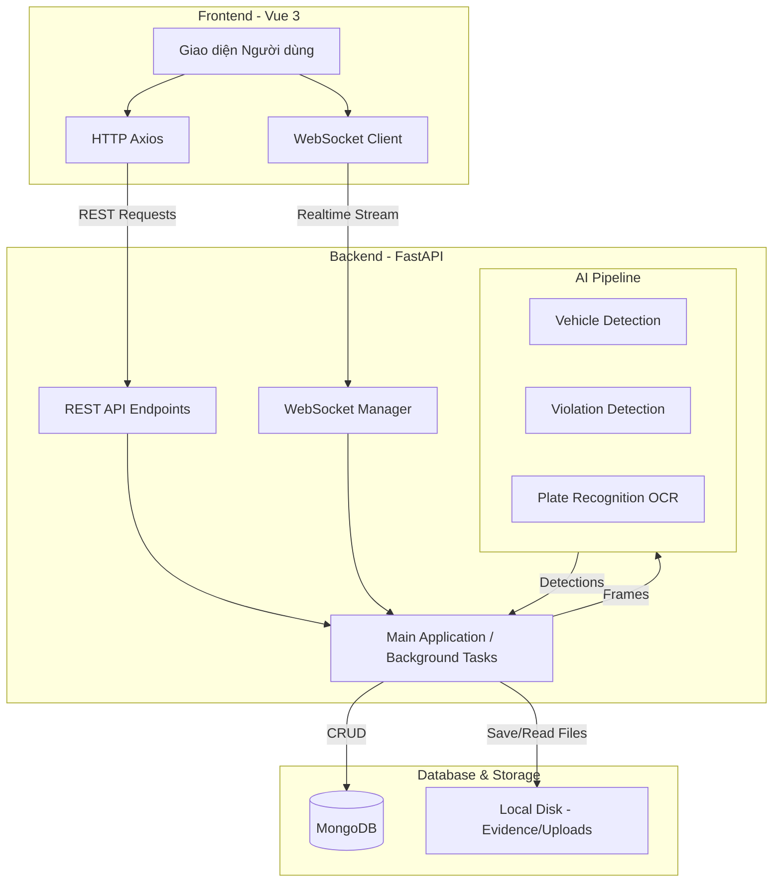
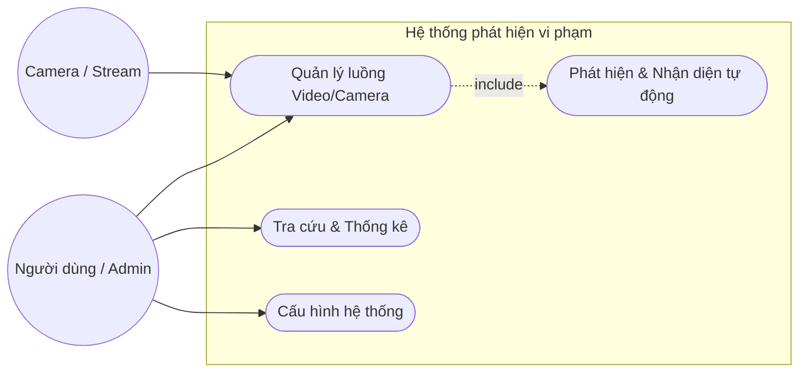
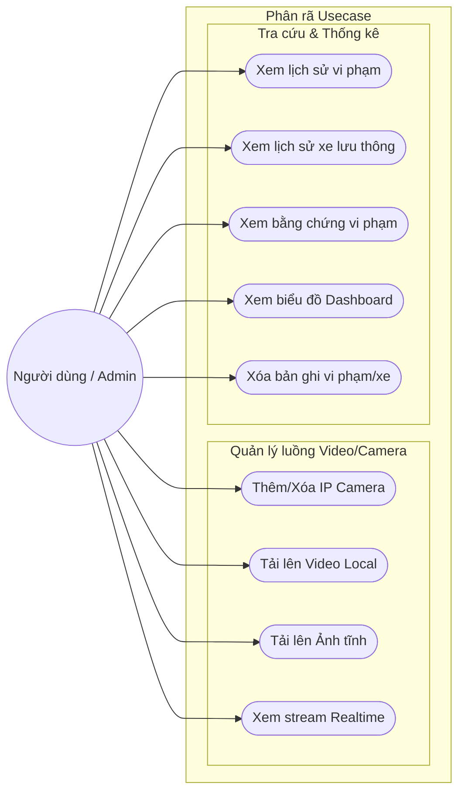
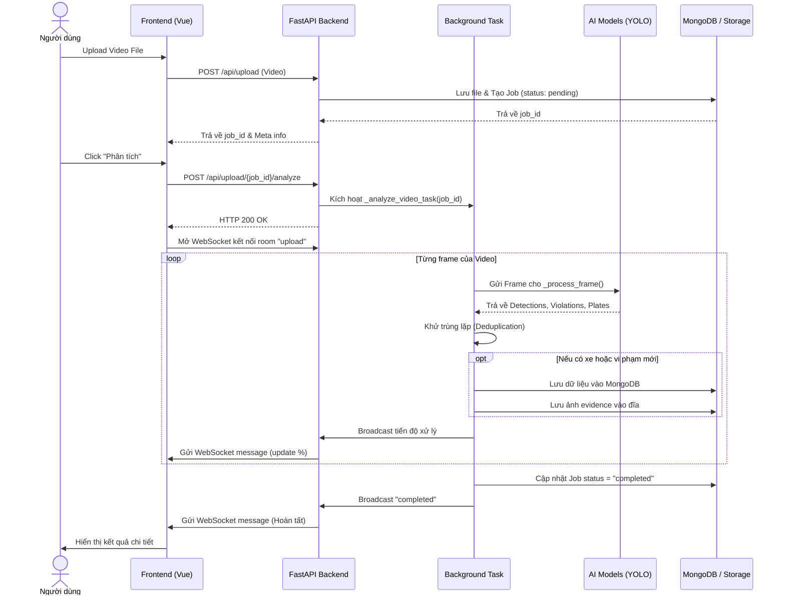

# CODEBASE.md – Traffic Violation Detection System v4.0

> Hệ thống phát hiện vi phạm giao thông sử dụng 4 model AI YOLOv8n.
> Cập nhật: 2026-07-19
>
> **Thay đổi mới nhất (2026-07-28 - Cải tiến Dashboard & Export Excel, Phân tích Ảnh):**
> - **Cải tiến trang Dashboard & Tính năng Xuất dữ liệu Excel**:
>   - Backend: Thêm endpoint `GET /api/export/excel` trong `main.py` và hàm `get_export_data()` trong `database.py`. Cho phép xuất 3 loại dữ liệu (`vehicles`, `violations`, `plates`) ra file `.xlsx` (dùng `openpyxl`). Ràng buộc khóa cứng tối đa 7 ngày gần nhất và không quá 1.000 dòng.
>   - Frontend: Thêm nút **Xuất dữ liệu Excel** và **Modal Export Excel** trong `Dashboard.vue`, bổ sung hàm `exportExcel()` trong `api/index.js`.
> - **Khôi phục hoàn toàn tính năng phân tích ảnh đơn lẻ (Single Image Analysis)**:
>   - Backend `main.py`: Thêm API endpoint `POST /api/analyze/image` nhận upload file ảnh, chạy qua pipeline AI `_process_frame`, lưu kết quả vào MongoDB với `source_type="image"` và trả về `annotated_image_base64`.
>   - Frontend UI `UploadAnalysis.vue`: Thêm thanh chuyển Chế độ phân tích (**Phân tích Video** & **Phân tích Ảnh**).

>
> **Thay đổi kể từ bản cập nhật trước (2026-07-19 – khắc phục giật lag & đếm trùng/nhảy ID):**
> - **Tích hợp Object Tracking thật (ByteTrack)** qua module mới `backend/app/utils/tracker.py` (dùng `ultralytics.trackers.BYTETracker`) — thay thế cơ chế dedup ad-hoc IOU/buffer trước đây. Mỗi phương tiện được gán 1 `track_id` ổn định xuyên suốt các frame (Kalman filter + Hungarian assignment).
> - Mỗi video-analysis job và mỗi camera stream có **1 tracker instance riêng** (không chia sẻ giữa các luồng chạy song song).
> - Vi phạm được định danh theo `(vehicle_track_id, violation_type)` thay vì so khớp IOU mỗi frame.
> - **Sửa lỗi chặn event loop** ở `_stream_mjpeg()`: inference AI chạy qua `run_in_executor`.
> - **Throttle WebSocket**: `websocket_manager.broadcast()` gửi song song với tần suất broadcast giới hạn tối thiểu 150ms/room.
> - **Ảnh preview WebSocket thu nhỏ riêng** (`WS_PREVIEW_MAX_WIDTH=960`, quality=70).
> - Frontend: tách ảnh preview realtime ra component riêng **`LivePreviewFrame.vue`** + coalesce cập nhật qua `requestAnimationFrame`.

> - `UploadAnalysis.vue` viết lại thành trang **phân tích nhiều video đồng thời** (multi-file), có **thanh trượt tốc độ** (frame_skip), **Tạm dừng/Tiếp tục** và **thanh trượt tua đến frame (seek)** cho từng job.
> - Backend bổ sung 3 endpoint điều khiển: `POST /api/upload/{job_id}/pause`, `/resume`, `/seek`.
> - Thêm collection **`plate_detections`** (lịch sử nhận diện biển số riêng biệt) + trang **`PlateHistory.vue`** (`/plates`) + module **`plate_validator.py`** (validate biển số chuẩn Việt Nam, sửa lỗi OCR).
> - Khử trùng lặp khi phân tích video nay **theo dõi vị trí xe/vi phạm liên tục** (cập nhật bbox thay vì chỉ bỏ qua) và **bổ sung biển số muộn** vào bản ghi vi phạm đã lưu (`update_violation_plate`) nếu OCR nhận ra biển số ở frame sau.
> - **ROI mặc định TẮT** (`ENABLE_ROI=false`, toạ độ mặc định phủ toàn frame) – trước đây mặc định BẬT với vùng giới hạn.
> - Thêm bước **Frame Enhancement** (upscale + tăng nét) trước khi đưa vào YOLO, cấu hình qua `ENABLE_FRAME_UPSCALE`, `ENABLE_FRAME_ENHANCE`, `YOLO_INFER_SIZE`.
> - Tối ưu hiệu năng: giới hạn `torch.set_num_threads(2)`, dùng `asyncio.to_thread()` cho các thao tác blocking (`cap.read()`, `save_evidence()`) để không chặn event loop khi chạy nhiều video song song.
> - Lỗi tính toán `calculate_containment_ratio()` (dùng nhầm `y1_in`) đã được **sửa**; các filter "Xe đạp/bicycle" không hợp lệ trong `DetectionHistory.vue`/`DetectionTable.vue` đã được **gỡ bỏ**.

---

## Mục lục

1. [Kiến trúc tổng quan](#kiến-trúc-tổng-quan)
2. [AI Models](#ai-models)
3. [Pipeline xử lý frame](#pipeline-xử-lý-frame)
4. [Backend Structure](#backend-structure)
5. [Backend – Chi tiết từng module](#backend--chi-tiết-từng-module)
6. [API Endpoints](#api-endpoints)
7. [Frontend Structure](#frontend-structure)
8. [Frontend – Chi tiết từng component](#frontend--chi-tiết-từng-component)
9. [Database Collections](#database-collections)
10. [Region of Interest (ROI)](#region-of-interest-roi)
11. [Deduplication (Khử trùng lặp)](#deduplication-khử-trùng-lặp)
12. [WebSocket & Realtime](#websocket--realtime)
13. [Hiệu năng & Xử lý bất đồng bộ](#hiệu-năng--xử-lý-bất-đồng-bộ-mới)
14. [DevOps & Deployment](#devops--deployment)
15. [Các tính năng & Trạng thái tích hợp](#các-tính-năng--trạng-thái-tích-hợp)
16. [Tech Stack](#tech-stack)
17. [Lỗi đã biết & Lưu ý](#lỗi-đã-biết--lưu-ý)
18. [Index Codebase (Danh mục & Phân tích chi tiết các file mã nguồn)](#index-codebase-danh-mục--phân-tích-chi-tiết-các-file-mã-nguồn)

---

## Kiến trúc tổng quan

```
┌────────────────────────────────────────────────────────────────┐
│                    Frontend (Vue 3 + Vite)                      │
│  Dashboard │ Upload&Phân tích │ Vi phạm │ Phương tiện          │
│  (Chart.js, Pinia, vue-router, Axios)                          │
└───────────────────────┬────────────────────────────────────────┘
                        │ REST API (Axios) + WebSocket
┌───────────────────────┴────────────────────────────────────────┐
│                    Backend (FastAPI + Uvicorn)                   │
│                                                                 │
│  main.py  (1574 dòng)                                           │
│  ├─ _process_frame(tracker=...) ─ Pipeline xử lý frame ┐       │
│  │   ① VehicleDetector  (vehicle_detection.pt)    │             │
│  │      + ByteTrack (track_id ổn định, per-job)   │             │
│  │   ② ViolationDetector (traffic_violation.pt)   │             │
│  │   ③ PlateRecognizer  (license_plate.pt +       │             │
│  │      license_ocr.pt)                            │             │
│  │   ④ ROI Filtering + Spatial Matching            │             │
│  │      (gắn vehicle_track_id cho violation)        │             │
│  │   ⑤ Bounding Box Drawing + Overlay              │             │
│  │   ⑥ Encode base64 (preview thu nhỏ riêng cho WS) │             │
│  ├─ REST endpoints (25 routes)                     │             │
│  ├─ WebSocket streaming (/ws/{camera_id})          │             │
│  │   (broadcast song song + throttle 150ms/room)   │             │
│  ├─ _analyze_video_task() – Background analysis    │             │
│  │   (Pause/Resume/Seek, dedup theo track_id)      │             │
│  └─ _stream_mjpeg() – MJPEG stream (run_in_executor,│             │
│      không còn chặn event loop; dedup theo track_id)│             │
├─────────────────────────────────────────────────────┘             │
│  database.py → MongoDB (Motor async driver)                      │
│    Collections: detections, violations, analysis_jobs,           │
│                  plate_detections                                 │
│  websocket_manager.py → Room-based broadcast (song song)         │
│  services/ → 4 AI service modules                                │
│  utils/ → yolo_wrapper, image_utils, evidence_storage,            │
│           plate_validator, tracker (ByteTrack, mới)               │
└──────────────────────────────────────────────────────────────────┘
```

---

## Biểu đồ hệ thống (System Diagrams)

### 1. Biểu đồ tổng quát luồng hoạt động (Architecture Diagram)
Mô tả sự tương tác giữa các luồng Frontend, Backend, AI Engine và Database.



### 2. Biểu đồ Usecase tổng quan
Mô tả các Actor và các khối Usecase chính.



### 3. Biểu đồ Usecase con
Phân rã chi tiết các tính năng cụ thể mà Người dùng/Quản trị viên có thể thao tác trên hệ thống.



### 4. Biểu đồ Sequence (Luồng phân tích Video)
Biểu diễn luồng tương tác tuần tự khi người dùng upload một video và tiến hành phân tích ngầm (Background Task) có deduplication.



---

## AI Models

| Model | File | Classes | Tác vụ | Conf mặc định |
|-------|------|---------|--------|----------------|
| Vehicle Detection | `vehicle_detection.pt` | 4: car, motorcycle, truck, bus | Phát hiện & phân loại phương tiện | 0.25 |
| Traffic Violation | `traffic_violation.pt` | 6: No Seatbelt, Seatbelt, Using mobile phone, With Helmet, Without Helmet, undefined | Phát hiện vi phạm (chỉ filter 3 vi phạm) | 0.35 |
| License Plate | `license_plate.pt` | 1: license_plate | Phát hiện vị trí biển số | 0.30 |
| License OCR | `license_ocr.pt` | 36: 0-9, A-Z | Nhận diện ký tự biển số | 0.25 |

### Category mapping (Vehicle)

| Class | Category | Label tiếng Việt |
|-------|----------|------------------|
| car | oto | Xe con |
| truck | oto | Xe tải |
| bus | oto | Xe bus |
| motorcycle | xe_may | Xe máy |

### Violation mapping

| Class ID | Type | Label | Là vi phạm? |
|----------|------|-------|-------------|
| 0 | no_seatbelt | Không thắt dây an toàn | ✅ |
| 1 | seatbelt | Thắt dây an toàn | ❌ (bỏ qua) |
| 2 | using_phone | Sử dụng điện thoại | ✅ |
| 3 | with_helmet | Đội mũ bảo hiểm | ❌ (bỏ qua) |
| 4 | no_helmet | Không đội mũ bảo hiểm | ✅ |
| 5 | undefined | Không xác định | ❌ (bỏ qua) |

---

## Pipeline xử lý frame

Hàm `_process_frame()` trong `main.py` thực hiện pipeline 8 bước (bổ sung bước Frame Enhancement so với bản trước):

```
Frame Input (numpy BGR)
    │
    ├─ ⓪ Frame Enhancement (tuỳ chọn, cấu hình qua config.py)
    │     ├─ Upscale (Bicubic) nếu width < UPSCALE_MIN_WIDTH → UPSCALE_TARGET_WIDTH
    │     └─ Enhance: Bilateral denoise + sharpen nhẹ (mặc định TẮT, chỉ bật khi video mờ/tối)
    │
    ├─ ① Vehicle Detection   → List[VehicleDetection]  (YOLO_INFER_SIZE=960)
    │     └─ **ByteTrack (mới)**: nếu `tracker` được truyền vào (per-job/per-camera,
    │        xem [Object Tracking](#deduplication-khử-trùng-lặp)) → mỗi VehicleDetection
    │        có thêm `track_id` ổn định xuyên frame, thay vì chỉ box thô.
    ├─ ② Violation Detection  → List[ViolationDetection] (violations_only=True)
    ├─ ③ Plate Recognition    → List[PlateDetection]
    │
    ├─ ④ ROI Filtering (tuỳ chọn – mặc định TẮT `ENABLE_ROI=false`, detect toàn frame)
    │     ├─ Kiểm tra bottom-center hoặc centroid trong ROI box
    │     ├─ active_vehicles, active_violations, active_plates
    │     └─ Đối tượng ngoài ROI: vẽ xám nhạt, không tính
    │
    ├─ ⑤ Spatial Matching (khớp không gian)
    │     ├─ Plate → Vehicle: containment ratio > 0.25
    │     ├─ Violation → Vehicle: containment ratio > 0.25
    │     ├─ Gán vehicle_class, plate_text, **vehicle_track_id (mới)** cho violation
    │     └─ Hậu xử lý: no_helmet → motorcycle, no_seatbelt → car
    │
    ├─ ⑥ Draw bounding boxes + Overlay info
    │     ├─ Vehicles: màu theo class (green/orange/blue)
    │     ├─ Violations: màu đỏ/magenta, thickness=3
    │     ├─ Plates: màu vàng
    │     └─ Overlay: camera_id, counts, FPS
    │
    └─ ⑦ Encode 2 phiên bản base64:
          ├─ `frame_base64` (mới: resize xuống `WS_PREVIEW_MAX_WIDTH=960`, quality=70)
          │  dùng để broadcast qua WebSocket – giảm payload/độ trễ hiển thị
          └─ `annotated_frame` (numpy, full-res) – dùng để lưu evidence trên đĩa
```

### Spatial Matching Algorithm

Sử dụng `calculate_containment_ratio()` trong `image_utils.py`:
- Tính diện tích giao (intersection) giữa hộp nhỏ (plate/violation) và hộp lớn (vehicle)
- Trả về tỉ lệ: `intersection_area / inner_area`
- Ngưỡng matching: `> 0.25`

---

## Backend Structure

```
backend/
├── .env                          # Environment variables
├── .env.example                  # Template env
├── Dockerfile                    # Docker build config
├── requirements.txt              # Python dependencies (40 packages)
├── yolov8n.pt                    # Pretrained YOLOv8n (fallback)
├── yolov8s.pt                    # Pretrained YOLOv8s (fallback)
├── evidence/                     # Ảnh bằng chứng vi phạm (theo ngày)
├── uploads/                      # Video upload tạm
├── app/
│   ├── __init__.py
│   ├── config.py                 # Cấu hình: model paths, thresholds, toggles, ROI, Frame Enhancement, Tracking, WS throttle, CORS (109 dòng)
│   ├── models.py                 # Pydantic schemas (18 models, +track_id/vehicle_track_id) (244 dòng)
│   ├── database.py               # MongoDB CRUD (491 dòng, 4 collections)
│   ├── main.py                   # FastAPI app, pipeline, endpoints (1574 dòng)
│   ├── websocket_manager.py      # WS room broadcast – song song + timeout (77 dòng)
│   ├── services/
│   │   ├── __init__.py
│   │   ├── vehicle_detector.py   # Vehicle Detection singleton + detect_tracked() (185 dòng)
│   │   ├── violation_detector.py # Violation Detection singleton (156 dòng)
│   │   ├── plate_recognizer.py   # 2-step Plate pipeline singleton (297 dòng)
│   │   └── mjpeg_reader.py       # MJPEG stream reader (172 dòng)
│   └── utils/
│       ├── __init__.py
│       ├── yolo_wrapper.py       # Unified YOLO wrapper – thread-safe (123 dòng)
│       ├── image_utils.py        # base64, resize, bbox draw, overlay (214 dòng)
│       ├── evidence_storage.py   # Lưu ảnh evidence ra disk (86 dòng)
│       ├── plate_validator.py    # Validate & chuẩn hoá biển số VN, sửa lỗi OCR (128 dòng)
│       └── tracker.py            # ByteTrack factory – object tracking per-job/camera (106 dòng) – MỚI
```

---

## Backend – Chi tiết từng module

### `config.py` (109 dòng)

Cấu hình toàn bộ ứng dụng, tất cả đều có thể override qua environment variables:

| Nhóm | Biến | Giá trị mặc định |
|------|------|-------------------|
| MongoDB | `MONGO_URI` / `MONGO_DB` | `mongodb://localhost:27017` / `traffic_violation_detection` |
| Model paths | `VEHICLE_MODEL_PATH`, `VIOLATION_MODEL_PATH`, `PLATE_MODEL_PATH`, `PLATE_OCR_MODEL_PATH` | `models/*.pt` |
| Confidence | `VEHICLE_CONF` / `VIOLATION_CONF` / `PLATE_CONF` / `PLATE_OCR_CONF` | 0.25 / 0.35 / 0.30 / 0.25 |
| Module toggles | `ENABLE_VEHICLE_DETECTION` / `ENABLE_VIOLATION_DETECTION` / `ENABLE_PLATE_RECOGNITION` | true / true / true |
| Frame | `FRAME_WIDTH` / `FRAME_HEIGHT` / `PROCESS_FPS` | **1920 / 1080** / 3 *(tăng từ 1280×720)* |
| Frame Enhancement | `ENABLE_FRAME_UPSCALE` / `UPSCALE_MIN_WIDTH` / `UPSCALE_TARGET_WIDTH` / `ENABLE_FRAME_ENHANCE` / `YOLO_INFER_SIZE` / `SAVE_ANNOTATED_EVIDENCE` | true / 960 / 1920 / **false** / 960 / true |
| Storage | `EVIDENCE_DIR` / `UPLOAD_DIR` / `MAX_UPLOAD_SIZE_MB` / `MAX_UPLOAD_DURATION_SEC` | backend/evidence / backend/uploads / 500 / 600 |
| CORS | `CORS_ORIGINS` | `http://localhost:5173,http://localhost:3000` |
| ROI | `ENABLE_ROI` / `ROI_X1,Y1,X2,Y2` | **false** / **0,0,1920,1080** *(trước đây `true` / 100,180,1180,700 – nay TẮT mặc định, detect toàn frame)* |
| Object Tracking **(mới)** | `ENABLE_OBJECT_TRACKING` | **true** – bật ByteTrack; tắt để rollback về dedup buffer IOU cũ |
| WebSocket | `WS_HEARTBEAT_INTERVAL` / `WS_BROADCAST_MIN_INTERVAL_MS` **(mới)** / `WS_PREVIEW_MAX_WIDTH` **(mới)** / `WS_PREVIEW_JPEG_QUALITY` **(mới)** | 30 / 150 / 960 / 70 |

> **Frame Enhancement**: `ENABLE_FRAME_UPSCALE` phóng to (Bicubic) các frame nhỏ hơn `UPSCALE_MIN_WIDTH` lên `UPSCALE_TARGET_WIDTH` trước khi detect (giúp nhận diện xe/biển số ở xa). `ENABLE_FRAME_ENHANCE` (denoise + sharpen nhẹ) mặc định tắt, chỉ nên bật với video gốc mờ/tối. `YOLO_INFER_SIZE=960` tăng độ phân giải suy luận YOLO so với mặc định 640 của Ultralytics.
>
> **Object Tracking & WS throttle (mới)**: `ENABLE_OBJECT_TRACKING=true` bật ByteTrack cho định danh phương tiện ổn định (xem [Deduplication](#deduplication-khử-trùng-lặp)). `WS_BROADCAST_MIN_INTERVAL_MS=150` giới hạn tần suất broadcast WebSocket (không ảnh hưởng tần suất xử lý AI/lưu DB). `WS_PREVIEW_MAX_WIDTH`/`WS_PREVIEW_JPEG_QUALITY` áp dụng riêng cho ảnh `frame_base64` gửi qua WebSocket, tách biệt với ảnh full-res lưu evidence.

### `models.py` (244 dòng) – 18 Pydantic schemas

| Schema | Mô tả |
|--------|-------|
| `PyObjectId` | Custom validator cho MongoDB ObjectId |
| `BoundingBox` | x1, y1, x2, y2, conf |
| `VehicleDetection` | bbox + class_id + class_name + category + `track_id` **(mới, Optional[int])** – ID theo dõi ổn định (ByteTrack), None nếu tracking tắt/lỗi |
| `ViolationDetection` | bbox + violation_type + label + is_violation + vehicle_class + plate_text + `vehicle_track_id` **(mới, Optional[int])** – track_id của xe gắn với vi phạm này |
| `CharDetection` | char + bbox (từng ký tự OCR) |
| `PlateDetection` | bbox + plate_text + char_boxes + char_confidences + plate_image_base64 |
| `FrameAnalysisResult` | Tổng hợp kết quả 1 frame (vehicles + violations + plates + fps) |
| `DetectionCreate` / `DetectionResponse` | CRUD schemas cho collection `detections`, có thêm `track_id` **(mới)** để audit/debug dedup |
| `ViolationCreate` / `ViolationResponse` | CRUD schemas cho collection `violations`, có thêm `vehicle_track_id` **(mới)** |
| `PlateDetectionCreate` / `PlateDetectionResponse` | CRUD schemas cho collection `plate_detections` (mới) |
| `WSMessage` | WebSocket message format: type + data |
| `MjpegStreamRequest` | mjpeg_url + camera_id + location + frame_skip + reconnect |
| `CameraInfo` | camera_id + status + fps + last_seen + frame_count |
| `VideoUploadResponse` | job_id + filename + file_size + duration_sec + estimated_process_sec |
| `AnalysisJobStatus` | Progress tracking: status + progress + counts_by_* + `frame_skip` |

### `database.py` (491 dòng) – MongoDB CRUD

- **Connection**: `AsyncIOMotorClient` với `serverSelectionTimeoutMS=5000`
- **Indexes tự động tạo** khi kết nối:
  - `detections`: `created_at` DESC, `vehicle_class`, `category`, `camera_id`
  - `violations`: `created_at` DESC, `violation_type`, `plate_text`, `camera_id`
  - `plate_detections` **(mới)**: `created_at` DESC, `plate_text`, `camera_id`, `is_valid`
  - `analysis_jobs`: `status`, `created_at` DESC

| Hàm | Collection | Mô tả |
|-----|-----------|--------|
| `create_detection()` | detections | Lưu phát hiện xe |
| `get_detections()` | detections | Query paginated + filter (vehicle_class, category, camera_id, source_file, source_type, time range) |
| `count_detections()` | detections | Đếm tổng |
| `delete_detection()` | detections | Xóa theo ID |
| `get_stats()` | detections | Aggregation by class + category (24h) |
| `create_violation()` | violations | Lưu vi phạm |
| `update_violation_plate()` **(mới)** | violations | Cập nhật `plate_text` (+ `vehicle_class`) cho một vi phạm đã lưu – dùng khi OCR nhận diện được biển số ở frame sau, muộn hơn lúc vi phạm được ghi nhận lần đầu |
| `get_violations()` | violations | Query paginated + filter + regex biển số (case-insensitive) |
| `count_violations()` | violations | Đếm tổng |
| `delete_violation()` | violations | Xóa theo ID |
| `get_violation_stats()` | violations | Aggregation by violation_type (24h) |
| `create_plate_detection()` **(mới)** | plate_detections | Lưu bản ghi nhận diện biển số |
| `get_plate_detections()` **(mới)** | plate_detections | Query paginated + filter (plate_text regex, camera_id, is_valid, source_file, source_type) |
| `count_plate_detections()` **(mới)** | plate_detections | Đếm tổng |
| `delete_plate_detection()` **(mới)** | plate_detections | Xóa theo ID |
| `get_plate_stats()` **(mới)** | plate_detections | Aggregation: tổng số hợp lệ/không hợp lệ + số tỉnh/thành duy nhất (24h) |
| `create_analysis_job()` | analysis_jobs | Tạo job phân tích video |
| `update_analysis_job()` | analysis_jobs | Cập nhật progress/status |
| `get_analysis_job()` | analysis_jobs | Lấy thông tin job |

### `websocket_manager.py` (77 dòng) – Room-based broadcast

- **Singleton**: `manager = ConnectionManager()`
- **Room system**: `Dict[str, Set[WebSocket]]` – mỗi camera_id là 1 room
- **Methods**: `connect()`, `disconnect()`, `broadcast(room)`, `broadcast_all()`, `send_personal()`
- **Broadcast song song (mới)**: `broadcast()`/`broadcast_all()` dùng `_send_one()` (nội bộ) qua `asyncio.gather()` với `asyncio.wait_for(timeout=2s)` cho từng client, thay vì vòng lặp `await` tuần tự — 1 client chậm/đứng không còn chặn việc gửi tới các client khác trong cùng room.
- **Dead connection cleanup**: tự dọn WebSocket bị lỗi/timeout khi broadcast (dựa trên kết quả `_send_one()` trả về `False`)

### `services/vehicle_detector.py` (185 dòng)

- **Singleton**: `vehicle_detector = VehicleDetector()`
- **Model**: `vehicle_detection.pt` (YOLOv8n custom, 4 classes)
- **Category mapping**: car/truck/bus → `oto`, motorcycle → `xe_may`
- **Màu bounding box** (BGR): car=Green, truck=Orange, bus=DeepSkyBlue, motorcycle=RedOrange
- **Helper methods**: `count_by_class()`, `count_by_category()`, `get_color()`
- **`detect_tracked(frame, tracker, imgsz=None)` (mới)**: phát hiện phương tiện VÀ gán `track_id` ổn định qua `utils.tracker.update_tracker()`. Nếu `tracker=None` (tracking tắt/lỗi), tự fallback về `detect()` thường (không track_id) — dùng làm cơ chế rollback an toàn.

### `services/violation_detector.py` (156 dòng)

- **Singleton**: `violation_detector = ViolationDetector()`
- **Model**: `traffic_violation.pt` (YOLOv8n custom, 6 classes)
- **Filter**: Chỉ trả về 3 loại vi phạm (class 0, 2, 4) khi `violations_only=True`
- **Màu** (BGR): no_seatbelt=Red, using_phone=Magenta, no_helmet=RedOrange

### `services/plate_recognizer.py` (297 dòng) – 2-step pipeline

- **Singleton**: `plate_recognizer = PlateRecognizer()`
- **Step 1**: `license_plate.pt` → detect vùng biển số
- **Step 2**: `license_ocr.pt` → nhận diện từng ký tự (imgsz=320 cho tốc độ)
- **Tiền xử lý ảnh** (`_preprocess_plate()`):
  1. CLAHE trên kênh L (LAB color space) – tăng tương phản
  2. Unsharp Masking (Gaussian blur + addWeighted) – làm nét
  3. Scale up nếu height < 80px hoặc width < 200px
- **Sắp xếp ký tự** (`_arrange_chars()`):
  - Tự động detect biển 1 dòng hay 2 dòng (dựa trên `cy_range > 35% plate_height`)
  - Biển 2 dòng: chia top/bottom theo `cy_mid`, sort mỗi dòng theo x
  - Biển 1 dòng: sort tất cả theo center x
- **Output**: `PlateDetection` với `plate_text`, `char_boxes`, `char_confidences`, `plate_image_base64` (ảnh crop có vẽ box ký tự)

### `services/mjpeg_reader.py` (172 dòng)

- **Hỗ trợ nguồn**: HTTP MJPEG URL (ESP32-CAM), Video file, Webcam index
- **Buffer nhỏ** cho HTTP MJPEG: `CAP_PROP_BUFFERSIZE=1` giảm độ trễ
- **Auto-reconnect**: max 3 lần, delay tăng dần (3s × count)
- **FPS tracking**: Exponential moving average (`0.9 * old + 0.1 * new`)
- **Async generator**: `stream_frames()` → yield từng frame
- **Health check**: Ping ESP32 `/status` endpoint

### `utils/yolo_wrapper.py` (123 dòng)

- **Unified wrapper** cho tất cả ultralytics YOLO models
- **Thread-safe**: `threading.Lock()` + `torch.inference_mode()`
- **Output format**: `List[Tuple[x1, y1, x2, y2, confidence, class_id]]`
- **Override parameters**: `conf`, `imgsz` per-call

### `utils/image_utils.py` (214 dòng)

| Hàm | Mô tả |
|-----|--------|
| `numpy_to_base64()` | BGR → base64 string (JPEG/PNG) |
| `base64_to_numpy()` | base64 → BGR numpy |
| `resize_keep_aspect()` | Resize giữ tỉ lệ, max FRAME_WIDTH×FRAME_HEIGHT |
| `upscale_frame()` **(mới)** | Phóng to frame nhỏ bằng Bicubic interpolation (dùng cho Frame Enhancement) |
| `enhance_frame()` **(mới)** | Bilateral denoise + Unsharp mask nhẹ để tăng độ nét trước khi detect |
| `vietnamese_to_ascii()` | Chuyển tiếng Việt có dấu → không dấu (cho cv2.putText) |
| `draw_bounding_box()` | Vẽ box + label với nền chữ |
| `crop_region()` | Crop vùng ảnh với padding |
| `add_overlay_info()` | Thêm thông tin lên góc trên (camera, counts, FPS) |
| `calculate_containment_ratio()` | Tính tỉ lệ bao chứa giữa 2 box (lỗi gõ nhầm `y1_in` trước đây đã được **sửa**) |

### `utils/evidence_storage.py` (86 dòng)

- **Lưu ảnh**: `evidence/{YYYY-MM-DD}/viol_{id}.jpg` (JPEG quality=85)
- **MongoDB chỉ lưu relative path**: `evidence/2026-06-04/viol_abc123.jpg`
- **Cleanup**: `cleanup_old_evidence(days=30)` – xóa thư mục cũ hơn N ngày (⚠️ vẫn chưa có nơi nào gọi hàm này, xem [Lỗi đã biết](#lỗi-đã-biết--lưu-ý))

### `utils/plate_validator.py` (128 dòng) – mới

Chuẩn hoá và kiểm định biển số xe theo chuẩn Việt Nam:

| Hàm | Mô tả |
|-----|--------|
| `normalize_plate_text()` | Bỏ khoảng trắng/ký tự đặc biệt, sửa lỗi OCR thường gặp theo vị trí ký tự (VD: 2 số đầu nhầm chữ → số qua `OCR_CORRECTIONS`, ký tự seri nhầm số → chữ qua `SERI_CORRECTIONS`) |
| `validate_vietnamese_plate()` | Kiểm tra định dạng `\d{2}[A-Z]{1,2}\d{4,6}` (+ biến thể biển điện `29MĐ...`) và mã tỉnh có nằm trong danh sách hợp lệ (`INVALID_PROVINCES` loại trừ các mã chưa cấp) |
| `get_plate_info()` | Entry point: trả về `{raw_text, normalized_text, is_valid, province_name, province_code}` |
| `PROVINCE_MAP` | Bảng tra mã tỉnh (11-99) → tên tỉnh/thành phố (dùng cho `PlateHistory.vue` lọc theo tỉnh) |

- **Được gọi bởi**: `services/plate_recognizer.py` sau bước OCR, và `main.py` khi lưu `plate_detections` để gắn cờ `is_valid` + tên tỉnh.

### `utils/tracker.py` (106 dòng) – MỚI, ByteTrack object tracking

Thay thế dedup ad-hoc IOU/buffer bằng bộ theo dõi đối tượng thật (`ultralytics.trackers.BYTETracker`):

| Hàm | Mô tả |
|-----|--------|
| `is_tracking_available()` | Kiểm tra `ultralytics.trackers`/`lap` có import được không (trả `False` nếu thiếu dependency) |
| `create_tracker(track_buffer=None)` | Tạo **1 instance `BYTETracker` MỚI** — load config từ `bytetrack.yaml` bundled sẵn trong ultralytics (`check_yaml` + `YAML.load` + `IterableSimpleNamespace`, đúng pattern nội bộ `ultralytics/trackers/track.py`). `track_buffer` override số processed-frame giữ track "lost" trước khi xoá hẳn (mặc định 30 frame ≈ 10s ở `PROCESS_FPS=3`, cao hơn hẳn buffer 15-frame/~5s của cơ chế cũ) |
| `update_tracker(tracker, detections_raw, frame_shape)` | Nhận list `(x1,y1,x2,y2,conf,cls_id)` thô từ `YOLOWrapper.detect()`, bọc thành `ultralytics.engine.results.Boxes` (layout 6 cột khớp sẵn `[xyxy,conf,cls]`), gọi `tracker.update(boxes)` → trả về list dict `{"bbox","track_id","conf","cls_id"}` (bbox đã qua Kalman filter, ổn định hơn box detect thô) |

- **Quan trọng về concurrency**: mỗi video-analysis job (`_analyze_video_task`) và mỗi camera stream (`_stream_mjpeg`) tự gọi `create_tracker()` để có **tracker riêng** — KHÔNG dùng `model.track(persist=True)` cấp cao vì `vehicle_detector` là singleton dùng chung giữa các job chạy song song, sẽ làm trộn lẫn track_id giữa các video/camera khác nhau nếu dùng chung 1 tracker.
- **Được gọi bởi**: `services/vehicle_detector.py::detect_tracked()`.
- **Dependency mới**: `lap>=0.5.12` (thuật toán Hungarian assignment, bắt buộc để `BYTETracker` hoạt động) — đã thêm vào `requirements.txt`.

---

## Phân tích chuyên sâu các luồng hoạt động chính (Deep Dive Workflows)

### 1. Luồng xử lý phân tích Frame Đơn (`_process_frame`)
Đây là hạt nhân cốt lõi của hệ thống, xử lý từng khung hình ảnh (từ camera stream, video upload hoặc ảnh lẻ).
1. **Tiền xử lý (Pre-processing)**: 
   - Có thể kích hoạt `Upscale` (tăng độ phân giải cho ảnh nhỏ) và `Enhance` (cải thiện chất lượng, làm nét) qua biến môi trường. Điều này giúp YOLO nhận diện tốt hơn ở khoảng cách xa.
   - Tọa độ ROI (Region of Interest) được tính toán lại theo tỷ lệ scale của khung hình để đảm bảo chính xác.
2. **Inference (Chạy AI Models)**: 
   - Đưa khung hình qua 3 models YOLO (đã load singleton trên RAM) theo tuần tự: `vehicle_detector` -> `violation_detector` -> `plate_recognizer`.
3. **Lọc không gian theo ROI**: 
   - Hàm `is_box_inside_roi()` kiểm tra điểm giữa cạnh dưới (bottom-center) hoặc tâm (centroid) của đối tượng. Nếu nằm ngoài ROI, đối tượng bị vô hiệu hóa (không tính toán) và vẽ viền xám mờ trên ảnh.
4. **Khớp không gian (Spatial Matching) & Hậu xử lý**: 
   - Các hộp của biển số và vi phạm (nhỏ hơn) được đem so sánh với các hộp của phương tiện (lớn hơn).
   - Nếu tỉ lệ chứa `containment_ratio` (diện tích giao / diện tích hộp nhỏ) > 0.25, biển số/vi phạm được "gắn" vào phương tiện đó. Nhờ vậy biết được vi phạm này là của xe loại nào, biển số mấy.
   - Logic dự phòng (Fallback): Nếu không khớp được xe do box lệch, hệ thống tự suy luận: lỗi `no_helmet` mặc định là của `motorcycle`, lỗi `no_seatbelt` là của `car`.
5. **Đóng gói (Packaging)**:
   - Vẽ lại toàn bộ bounding boxes, chữ, overlay info lên khung hình.
   - Encode Base64 và trả kết quả tổng hợp JSON.

### 2. Luồng phân tích Video Background (`_analyze_video_task`)
Hệ thống xử lý video nặng (lên tới 500MB) mà không block ứng dụng, hỗ trợ nhiều video song song có thể **Tạm dừng/Tiếp tục/Tua frame** từ giao diện.
1. **Kiểm soát hàng đợi**: Chỉ cho phép tối đa `MAX_CONCURRENT_ANALYSIS` (mặc định = 2) video phân tích cùng lúc để tránh sập RAM. `torch.set_num_threads(2)` được thiết lập lúc khởi động (`lifespan`) để giới hạn số luồng CPU của PyTorch, tránh tranh chấp tài nguyên khi nhiều video chạy song song.
2. **Đọc Frame (non-blocking)**: Sử dụng `cv2.VideoCapture` kết hợp tua nhanh (`frame_skip` hoặc tính toán lại theo FPS quy định). `cap.read()` và `save_evidence()`/`save_plate_evidence()` được gọi qua `asyncio.to_thread()` để không chặn event loop – quan trọng khi nhiều video/WebSocket cùng chạy. Vòng lặp `yield` bằng `asyncio.sleep(0.01)` mỗi frame.
3. **Pause / Resume / Seek**: Mỗi job có một `asyncio.Event` riêng trong `_analysis_running_events`. `POST /pause` gọi `ev.clear()` khiến vòng lặp await `ev.wait()` bị treo; `POST /resume` gọi `ev.set()`. `POST /seek?frame=N` ghi vào `_analysis_seek_targets[job_id]`, vòng lặp đọc thấy sẽ set vị trí đọc video (`cap.set(CAP_PROP_POS_FRAMES, ...)`) tới frame đích ở lượt kế tiếp (tự động resume nếu đang pause để seek có hiệu lực ngay).
4. **Khử trùng lặp bằng Object Tracking (ByteTrack) — thay thế cơ chế buffer cũ**:
   - **Vấn đề cũ**: 1 phương tiện di chuyển trong 3 giây ở 30 FPS sẽ tạo ra tới 90 kết quả phát hiện giống nhau; cơ chế buffer IOU cũ (15 frame ~5s, greedy/order-dependent) có thể khiến 2 xe gần nhau "cướp" slot của nhau (nhảy ID) hoặc tạo bản ghi trùng khi xe bị che khuất >5s.
   - **Giải pháp (mới)**: mỗi job tạo 1 `tracker = create_tracker()` riêng (xem [`utils/tracker.py`](#backend--chi-tiết-từng-module)); `vehicle_detector.detect_tracked()` trả về mỗi xe kèm `track_id` ổn định (Kalman filter, dung sai che khuất mặc định 30 frame ≈ 10s). Dedup vehicles chỉ còn là: giữ `dict[track_id -> db_id]`, track_id mới → tạo bản ghi, track_id đã có → bỏ qua (không tạo trùng dù xe bị che khuất tạm thời rồi xuất hiện lại).
   - Violations định danh bằng `(vehicle_track_id, violation_type)` — lần đầu gặp key này mới lưu DB; nếu vi phạm không khớp không gian được với xe có track_id nào (hiếm), fallback dùng lại `calculate_overlap_score` (IOU/containment) trên buffer `recent_violations` như cơ chế cũ.
   - **Bổ sung biển số muộn**: nếu một vi phạm đã lưu DB nhưng lúc đó chưa nhận diện được biển số, và ở một frame sau OCR nhận ra biển số cho cùng track, hệ thống gọi `update_violation_plate(db_id, plate_text, vehicle_class)` để cập nhật bản ghi đã tồn tại thay vì tạo bản ghi trùng.
   - **Rollback**: đặt `ENABLE_OBJECT_TRACKING=false` để quay lại cơ chế buffer IOU cũ nguyên vẹn (vẫn còn trong code làm nhánh fallback).
5. **Lưu trữ & Streaming**: 
   - Chỉ những xe/vi phạm ứng với 1 track_id (hoặc key) **mới** mới được gọi lệnh lưu vào DB (`create_detection`, `create_violation`) và crop ảnh evidence lưu xuống ổ cứng.
   - Liên tục update biến `job.progress` vào MongoDB, đồng thời broadcast qua WebSocket room `upload` để client theo dõi tiến độ thanh progress bar hiển thị realtime — **broadcast được throttle tối thiểu `WS_BROADCAST_MIN_INTERVAL_MS` (150ms)**, không ảnh hưởng tần suất xử lý AI/lưu DB.
   - Log định kỳ mỗi 30 frame: `processing_ms` (thời gian inference) + `active_tracks` (số track đang theo dõi) để giám sát hiệu năng/dedup.

### 3. Luồng phân tích Streaming Camera MJPEG (`_stream_mjpeg`)
1. **Re-connection & Kháng lỗi**: Client `MJPEGReader` hỗ trợ tự động kết nối lại khi IP Camera (như ESP32-CAM) ngắt kết nối tạm thời.
2. **Phân phối khung hình (đã sửa lỗi chặn event loop)**: Nhận frame từ HTTP Stream, gọi `_process_frame()` qua `run_in_executor` (trước đây gọi **trực tiếp/đồng bộ**, chặn toàn bộ event loop — mọi WebSocket/HTTP khác bị đứng trong lúc inference 1 frame; đây là nguyên nhân chính gây giật lag khi xem stream trực tiếp, nay đã sửa giống `_analyze_video_task()`).
3. **Object Tracking theo camera (mới)**: mỗi camera có 1 `tracker` riêng (lưu tại `_cameras[camera_id]["tracker"]`). Khi bật tracking, DB lưu ngay khi 1 track_id **mới** xuất hiện (không cần đợi mẫu 60 frame như trước) và mỗi track/mỗi `(track_id, violation_type)` chỉ lưu đúng 1 lần trong suốt phiên stream. Khi tắt tracking (`ENABLE_OBJECT_TRACKING=false` hoặc lỗi), fallback về hành vi cũ: lưu mẫu mỗi 60 frame (~20s), dedup nội-frame theo `class_name`.
4. **Truyền dẫn WebSocket**: Hình ảnh đã được AI vẽ bounding box (`frame_base64`, nay đã resize nhỏ + throttle broadcast tối thiểu 150ms) và số liệu phân tích được gửi đẩy xuống mọi Client frontend đang subscribe vào room `camera_id` qua WebSocket.

---

## API Endpoints (Bảng danh sách các API và chức năng từng API)

Hệ thống có 25 Core Endpoints + 1 WebSocket. Cấu trúc Response/Request áp dụng Pydantic models (tham khảo `models.py`).

> ⚠️ Docstring đầu file `main.py` (dòng 1-34) liệt kê danh sách endpoint đã **lỗi thời**: vẫn ghi `POST /api/analyze/image` (đã bị gỡ) và thiếu các endpoint `plates`, `pause/resume/seek` mới. Bảng dưới đây phản ánh đúng route thực tế trong code (`@app.get/post/delete/websocket`).

### 1. Nhóm API Hệ Thống & Camera

| Method | Endpoint | Payload / Params | Response | Chức năng chi tiết |
|--------|----------|-------------------|----------|---------------------|
| `GET`  | `/` | N/A | `{"status": "ok", "models": {...}, "cameras": {...}}` | Health Check: Trả về trạng thái load của 3 models YOLO (Vehicle, Violation, Plate) và danh sách camera in-memory. |
| `GET`  | `/api/cameras` | N/A | `{"cameras": [CameraInfo, ...]}` | Liệt kê tất cả Camera stream đã được đăng ký và trạng thái hiện tại. |
| `POST` | `/api/cameras` | `MjpegStreamRequest` | `{"message": "...", "camera": CameraInfo}` | Thêm một IP Camera MJPEG mới vào hệ thống (lưu trên RAM). |
| `DELETE` | `/api/cameras/{id}` | N/A | `{"message": "..."}` | Hủy và đóng Stream của Camera có ID tương ứng, xóa khỏi RAM. |
| `GET`  | `/api/cameras/{id}/status` | N/A | `CameraInfo` | Trả về trạng thái, location, url, fps và last_seen của Camera. |

### 2. Nhóm API Phân Tích Đơn Lẻ (Single Frame)

> ⚠️ Chế độ phân tích **ảnh tĩnh** (`/api/analyze/image`) đã bị **gỡ bỏ hoàn toàn** khỏi backend (không còn route) và frontend (`UploadAnalysis.vue` không còn tab Image). Chỉ còn lại endpoint phân tích 1 frame Base64 dưới đây (không có UI nào trong frontend hiện đang gọi tới).

| Method | Endpoint | Payload / Params | Response | Chức năng chi tiết |
|--------|----------|-------------------|----------|---------------------|
| `POST` | `/api/analyze/frame` | `{"frame_base64": "...", "camera_id": "..."}` | `FrameAnalysisResult` | Phân tích 1 frame duy nhất được gửi qua Base64. Trả về chi tiết các boxes của xe, vi phạm, biển số mà không lưu DB hay lưu evidence. |

### 3. Nhóm API Phân Tích Video Hàng Loạt (Background Tasks)

| Method | Endpoint | Payload / Params | Response | Chức năng chi tiết |
|--------|----------|-------------------|----------|---------------------|
| `POST` | `/api/upload` | `multipart/form-data` (file video) | `VideoUploadResponse` | Upload file video (max 500MB, max 10 phút). Hỗ trợ chọn nhiều file cùng lúc ở frontend (mỗi file gọi 1 lần). Trả về thông tin meta, khởi tạo 1 Job phân tích có ID vào DB nhưng chưa phân tích. |
| `POST` | `/api/upload/{job_id}/analyze` | `?frame_skip=N` | `{"message": "Started..."}` | Kích hoạt tác vụ phân tích chạy ngầm cho Video đã upload. `frame_skip` lấy từ "thanh trượt tốc độ" ở UI. Có kiểm soát số lượng tác vụ song song `MAX_CONCURRENT_ANALYSIS`. |
| `GET`  | `/api/upload/{job_id}/status` | N/A | `AnalysisJobStatus` | API Polling: Xem tiến độ % của Job, số frame đã xử lý, tổng xe/vi phạm/biển số đã gom được. |
| `POST` | `/api/upload/{job_id}/pause` **(mới)** | N/A | `{"message": "Paused", "job_id": ...}` | Tạm dừng một job đang phân tích (clear `asyncio.Event`). 404 nếu job không đang chạy. |
| `POST` | `/api/upload/{job_id}/resume` **(mới)** | N/A | `{"message": "Resumed", "job_id": ...}` | Tiếp tục một job đang tạm dừng (set `asyncio.Event`). |
| `POST` | `/api/upload/{job_id}/seek` **(mới)** | `?frame=N` | `{"message": "Seeking to frame N", ...}` | Tua video phân tích tới frame `N` (tự resume nếu đang pause để seek có hiệu lực ngay). |

### 4. Nhóm API Điều Khiển Stream

| Method | Endpoint | Payload / Params | Response | Chức năng chi tiết |
|--------|----------|-------------------|----------|---------------------|
| `POST` | `/api/stream/start` | `MjpegStreamRequest` | `{"message": "Started", "camera_id": "..."}` | Bắt đầu chạy luồng nền `_stream_mjpeg()`, kết nối MJPEG stream từ URL và đẩy kết quả liên tục vào Queue và WebSocket. |
| `POST` | `/api/stream/stop` | `?camera_id=...` | `{"message": "Stopped"}` | Ngắt luồng Stream của một Camera đang chạy nền. |
| `GET`  | `/api/stream/status` | N/A | `{"streams": [...]}` | Xem các streams đang active (trả về danh sách Task async đang chạy). |

### 5. Nhóm API Truy Xuất Lịch Sử & Thống Kê (CRUD Database)

| Method | Endpoint | Payload / Params | Response | Chức năng chi tiết |
|--------|----------|-------------------|----------|---------------------|
| `GET`  | `/api/detections` | `?skip,limit,vehicle_class,category,camera_id,source_file` | `{"detections": [...], "total": N}` | Pagination list các phương tiện đã phát hiện. Hỗ trợ nhiều filter. |
| `DELETE` | `/api/detections/{id}` | N/A | `{"message": "Deleted"}` | Xóa một bản ghi nhận diện xe khỏi database. |
| `GET`  | `/api/stats` | `?hours=24` | `{class_counts, category_counts, ...}` | Sử dụng MongoDB Aggregation để thống kê lượng xe phát hiện được trong N giờ qua. |
| `GET`  | `/api/violations` | `?skip,limit,violation_type,camera_id,plate_text,...` | `{"violations": [...], "total": N}` | Pagination list các lịch sử vi phạm. Hỗ trợ tìm kiếm theo regex biển số xe `plate_text`. |
| `DELETE` | `/api/violations/{id}` | N/A | `{"message": "Deleted"}` | Xóa một bản ghi vi phạm. |
| `GET`  | `/api/violations/stats` | `?hours=24` | `{violation_counts, ...}` | Aggregation thống kê số vi phạm theo loại trong N giờ qua. |
| `GET`  | `/api/plates` | `?skip,limit,plate_text,camera_id,is_valid,source_file,source_type` | `{"plates": [...], "total": N}` | Liệt kê lịch sử nhận diện biển số xe (collection `plate_detections`), hỗ trợ regex biển số và lọc theo `is_valid`. |
| `DELETE` | `/api/plates/{id}` **(mới)** | N/A | `{"message": "Deleted"}` | Xóa một bản ghi nhận diện biển số. |
| `GET`  | `/api/plates/stats` **(mới)** | `?hours=24` | `{total_plates, valid_plates, invalid_plates, unique_provinces}` | Aggregation thống kê số biển số hợp lệ/không hợp lệ và số tỉnh/thành duy nhất trong N giờ qua – phục vụ KPI cards của `PlateHistory.vue`. |
| `GET`  | `/api/evidence/{path}` | N/A | `FileResponse` | Phục vụ trực tiếp file ảnh hình phạt/evidence từ ổ cứng (folder `evidence`). |

### 6. WebSocket
| Method | Endpoint | Giao thức | Chức năng chi tiết |
|--------|----------|-----------|---------------------|
| `WS` | `/ws/{camera_id}` | Event-driven JSON (`type`, `data`) | Client kết nối để nhận realtime data. Hỗ trợ Ping/Pong (`{"type": "ping"}`). Tự động nhận stream ảnh dạng `frame_result` từ API stream, hoặc nhận tiến độ `upload_progress` nếu `camera_id` là `"upload"`. |

---

## Frontend Structure

```
frontend/
├── .env                          # VITE_API_URL, VITE_WS_URL
├── .env.example
├── index.html                    # Entry HTML (Google Fonts: Inter, JetBrains Mono)
├── package.json                  # Dependencies
├── vite.config.js                # Vite config (proxy /api → :8000, /ws → ws://:8000)
├── src/
│   ├── main.js                   # Vue app + Router (5 routes) + Pinia (31 dòng)
│   ├── App.vue                   # Layout: Sidebar thu gọn/mở rộng + breadcrumb + đồng hồ + health check (440 dòng)
│   ├── api/
│   │   └── index.js              # Axios API client (99 dòng, 15 exported functions)
│   ├── assets/
│   │   └── main.css              # Design system: CSS Variables, Dark Theme (695 dòng)
│   ├── views/
│   │   ├── Dashboard.vue         # 5 KPI cards + Doughnut/Bar charts + DetectionTable (409 dòng)
│   │   ├── UploadAnalysis.vue    # Multi-video upload/phân tích, speed slider, pause/resume/seek (784 dòng)
│   │   ├── ViolationHistory.vue  # Violation list + filter + evidence modal (281 dòng)
│   │   ├── DetectionHistory.vue  # Stats chips + DetectionTable (51 dòng)
│   │   └── PlateHistory.vue      # KPI cards + filter + bảng lịch sử biển số (391 dòng) – MỚI
│   └── components/
│       ├── DetectionTable.vue    # Bảng lịch sử phát hiện xe + filter + pagination (204 dòng)
│       ├── LivePreviewFrame.vue  # Ảnh preview realtime (base64) tách riêng để tránh re-render cả card (20 dòng) – MỚI, đã tích hợp vào UploadAnalysis.vue
│       ├── DetectionFeed.vue     # Realtime detection feed dạng timeline (chưa tích hợp)
│       ├── VideoStream.vue       # MJPEG stream viewer WebSocket, đã throttle qua RAF (460 dòng, chưa tích hợp)
│       ├── VideoUploader.vue     # Video drag & drop uploader (168 dòng) – ĐÃ GỠ khỏi UploadAnalysis.vue, hiện không còn nơi nào import
│       ├── ROIEditor.vue         # Canvas cấu hình Stop Line/Lanes (chưa tích hợp)
│       └── ViolationTable.vue    # Bảng vi phạm dùng chung (chưa tích hợp)
```

---

## Frontend – Chi tiết từng component

### `main.js` (31 dòng) – Router config

| Path | Component | Title |
|------|-----------|-------|
| `/` | Dashboard | Tổng quan |
| `/upload` | UploadAnalysis | Phân tích Video |
| `/violations` | ViolationHistory | Vi phạm giao thông |
| `/history` | DetectionHistory | Lịch sử phương tiện |
| `/plates` | PlateHistory **(mới)** | Biển số xe |

- **State management**: Pinia (đã setup nhưng chưa tạo store nào)
- **Page title**: Auto-update theo `router.afterEach` (format: `"{title} | Giám sát Vi phạm GT"`)

### `App.vue` (440 dòng) – Layout

- **Sidebar thu gọn/mở rộng thủ công**: nút toggle ở header (`panel-left-open/close`), không chỉ tự co lại theo breakpoint như trước. `navItems` gồm 5 mục, có mục **"Biển số xe" → `/plates`** (mới).
- **Breadcrumb + đồng hồ realtime**: header hiển thị tên trang hiện tại (tính từ `navItems`/`route.meta.title`) và đồng hồ cập nhật mỗi giây (`setInterval` 1000ms).
- **Health check**: Gọi `GET /` mỗi 15 giây, hiển thị trạng thái 3 model AI (đọc `data.models.vehicle_detector/violation_detector/plate_recognizer`)
- **Page transition**: Fade + slide (`out-in` transition trên `router-view`)

### `api/index.js` (99 dòng) – 15 exported functions

| Hàm | Method | Endpoint |
|-----|--------|----------|
| `getHealth()` | GET | `/` |
| `getDetections(params)` | GET | `/api/detections` |
| `deleteDetection(id)` | DELETE | `/api/detections/{id}` |
| `getStats(hours)` | GET | `/api/stats` |
| `getViolations(params)` | GET | `/api/violations` |
| `deleteViolation(id)` | DELETE | `/api/violations/{id}` |
| `getViolationStats(hours)` | GET | `/api/violations/stats` |
| `getPlateDetections(params)` **(mới)** | GET | `/api/plates` |
| `deletePlateDetection(id)` **(mới)** | DELETE | `/api/plates/{id}` |
| `getPlateStats(hours)` **(mới)** | GET | `/api/plates/stats` |
| `uploadVideo(file, onProgress)` | POST | `/api/upload` (multipart, timeout 300s) |
| `startAnalysis(jobId, frameSkip)` | POST | `/api/upload/{id}/analyze` |
| `getAnalysisStatus(jobId)` | GET | `/api/upload/{id}/status` |
| `pauseAnalysis(jobId)` **(mới)** | POST | `/api/upload/{id}/pause` |
| `resumeAnalysis(jobId)` **(mới)** | POST | `/api/upload/{id}/resume` |
| `seekAnalysis(jobId, frame)` **(mới)** | POST | `/api/upload/{id}/seek` |
| `getEvidenceUrl(path)` | — | Tạo URL evidence image |
| `createWebSocket(room)` | WS | `/ws/{room}` |

- **Interceptor**: Response interceptor tự extract `res.data`, error interceptor hiển thị `detail`
- **`analyzeImage()` đã bị xóa** khỏi file (chỉ còn comment `// (Image analysis removed)` đánh dấu vị trí cũ)

### `assets/main.css` (695 dòng) – Design System

- **Dark theme**: `--bg-base: #0a0f1e`, `--bg-surface: #111827`
- **Accent colors**: primary=#3b82f6, success=#10b981, warning=#f59e0b, danger=#ef4444
- **Typography**: Inter (body), JetBrains Mono (code)
- **Components**: `.card`, `.badge`, `.btn`, `.input`, `.data-table`, `.spinner`, `.status-dot`, cùng các style riêng cho video-card/speed-slider/seek-slider của `UploadAnalysis.vue` (tăng gần gấp đôi số dòng so với bản trước)
- **Animations**: fadeIn, pulse, spin, glow-pulse, slideInRight
- **Custom scrollbar**: 6px dark theme

### `views/Dashboard.vue` (409 dòng)

- **5 KPI Cards**: Tổng phương tiện, Xe ô tô, Xe máy (3 card từ `vehicleStats`), Tổng vi phạm, **Biển số nhận diện** (mới, từ `getPlateStats()`) – 2 card đầu/vi phạm có `router-link` để nhảy trang
- **Charts row**:
  - Doughnut chart: Phân bố loại xe (vue-chartjs)
  - Bar chart ngang: Vi phạm giao thông
- **DetectionTable**: Component embed hiển thị lịch sử
- **Auto-refresh**: Gọi `getStats()` + `getViolationStats()` + `getPlateStats()` định kỳ

### `views/UploadAnalysis.vue` (784 dòng) – File lớn nhất frontend

- **Đã bỏ hoàn toàn chế độ Image** (không còn tab chọn Image/Video) – chỉ còn phân tích **video, nhiều file cùng lúc**.
- **Upload nhiều video**: input `multiple`, kéo-thả hoặc chọn nhiều file → mỗi file tạo 1 `videoJob` độc lập trong `videoJobs[]` (không dùng lại component `VideoUploader.vue` nữa, logic drag & drop viết trực tiếp trong view).
- **Thanh trượt tốc độ (Speed slider)**: chọn `frame_skip` (x1, x2, x3, ...) áp dụng cho các video **chưa bắt đầu** phân tích; hiển thị mô tả tốc độ tương ứng.
- **Mỗi video-card** hiển thị: tên file, size, duration, trạng thái (`pending/uploading/uploaded/processing/paused/completed/error`).
- **Điều khiển khi đang chạy**: nút Tạm dừng/Tiếp tục (`togglePause` → `pauseAnalysis`/`resumeAnalysis`), progress bar %, số frame đã xử lý, số liệu realtime (xe/vi phạm/biển số).
- **Thanh trượt tua frame (Seek slider)**: kéo tới frame bất kỳ → `seekToFrame()` gọi `seekAnalysis(jobId, frame)`.
- **Live preview (đã tối ưu, mới)**: ảnh base64 nhận qua WebSocket không còn lưu trực tiếp trong object `reactive()` của job (`job.latestFrame` cũ) mà lưu ở map riêng `latestFrames` (`shallowReactive`, khoá theo `job.job_id`), và render qua component con **`LivePreviewFrame.vue`** — đổi ảnh chỉ re-render đúng component nhỏ này, không kéo theo diff lại cả card. Các message WebSocket đến được gom qua `requestAnimationFrame` (`queueFrameUpdate()`/`flushPendingFrames()`) thay vì set state ngay lập tức mỗi message.
- **Kết quả hoàn tất**: 3 stat card (phương tiện/vi phạm/biển số), badge breakdown theo loại, danh sách chi tiết có thể mở rộng (`job.expanded`) kèm thumbnail evidence.
- **Evidence Modal**: Full-size ảnh bằng chứng + chi tiết vi phạm (loại, biển số, thời gian)
- **Polling**: `getAnalysisStatus()` định kỳ song song với nhận WebSocket room `"upload"`

### `components/LivePreviewFrame.vue` (20 dòng) – MỚI

- **Props**: `frame` (String, base64 JPEG) — không có state nội bộ, thuần presentational.
- **Mục đích**: cô lập phạm vi re-render của Vue khi ảnh preview đổi liên tục (mỗi WebSocket message) — chỉ `` trong component này bị re-render, không kéo theo card cha (`UploadAnalysis.vue`) phải diff lại progress bar/nút bấm/seek slider.
- **Style riêng** (`<style scoped>`): copy lại `.vc-preview`/`.vc-preview-img` từ `UploadAnalysis.vue` (CSS `scoped` không xuyên qua component con nên phải khai báo lại).
- **Sử dụng bởi**: `UploadAnalysis.vue` (mỗi video-job hiển thị 1 instance khi đang `processing`/`paused`).

### `views/ViolationHistory.vue` (281 dòng)

- **Stats cards**: Tổng vi phạm + 3 loại vi phạm (24h aggregation)
- **Filters**: Dropdown loại vi phạm + Input tìm biển số (debounce 500ms)
- **Data table**: hiển thị biển số, loại vi phạm, confidence, nguồn, evidence
- **Pagination**: Prev/Next, 20 items/page
- **Evidence modal**: Ảnh + chi tiết (loại vi phạm, biển số, confidence, thời gian, camera)
- **Xóa**: Confirm dialog → `deleteViolation()` → reload data + stats

### `views/DetectionHistory.vue` (51 dòng)

- **Stats chips**: Tổng phát hiện + Xe ô tô + Xe máy (24h) – đã **gỡ bỏ chip "Xe đạp"** không hợp lệ (model không có class bicycle)
- **DetectionTable component**: Embed trực tiếp

### `views/PlateHistory.vue` (391 dòng) – MỚI, route `/plates`

- **4 KPI Cards**: Tổng biển số, Hợp lệ, Không hợp lệ, Số Tỉnh/TP duy nhất (từ `getPlateStats()`)
- **Filters**: Input tìm biển số (debounce), dropdown trạng thái hợp lệ (`is_valid`), dropdown nguồn (stream/upload/image)
- **Data table** (9 cột): #, Thời gian, Biển số, Trạng thái (hợp lệ/không), Tỉnh/TP, Độ tin cậy, Nguồn, Minh chứng, Xóa
- **Dùng chung logic** validate/tỉnh thành với backend `plate_validator.py` (dữ liệu `is_valid`/`province_name` được tính sẵn ở backend lúc lưu)

### `components/DetectionTable.vue` (204 dòng)

- **Props**: `autoRefresh` (boolean), `camera` (string)
- **Filter**: Dropdown loại xe + Dropdown nhóm xe (chỉ còn `oto`/`xe_may` – đã **gỡ option "Xe đạp/bicycle"** không hợp lệ)
- **Cột table**: #, Thời gian, Loại xe (badge), Nhóm, Confidence, Camera, Ảnh (thumb), Xóa
- **Evidence modal**: Click thumbnail → full-size image (Teleport to body)
- **Pagination**: 15 items/page
- **Auto-refresh**: `setInterval(loadData, 30000)` khi `autoRefresh=true`
- **Expose**: `loadData()` để parent gọi refresh

### `components/VideoUploader.vue` (168 dòng) – ⚠️ Không còn được sử dụng

- **Drag & drop zone**: Accept video (mp4/avi/mov/mkv/wmv)
- **Validation**: Max 500MB, max 10 phút (đọc metadata qua `<video>` element)
- **Progress bar**: Gradient xanh → cyan, hiển thị % upload
- **Events**: `@uploaded(result)`, `@error(err)`
- **Trạng thái**: `UploadAnalysis.vue` đã tự viết lại toàn bộ logic upload nhiều file trực tiếp trong view (không còn `import VideoUploader`) – component này hiện **không được import ở bất kỳ đâu** trong codebase, có thể xem xét xóa hoặc tái sử dụng lại.

---

## Database Collections

### `detections` (vehicles)
```json
{
  "_id": "ObjectId",
  "vehicle_class": "car",          // "car" | "truck" | "bus" | "motorcycle"
  "category": "oto",               // "oto" | "xe_may"
  "confidence": 0.85,
  "camera_id": "CAM_01",
  "source_type": "stream",         // "stream" | "upload" | "image"
  "source_file": "traffic.mp4",    // null nếu từ stream
  "evidence_path": "evidence/2026-06-04/viol_abc.jpg",
  "created_at": "ISODate"
}
```
**Indexes**: `created_at` DESC, `vehicle_class`, `category`, `camera_id`

### `violations` (vi phạm giao thông)
```json
{
  "_id": "ObjectId",
  "violation_type": "no_helmet",       // "no_helmet" | "no_seatbelt" | "using_phone"
  "violation_label": "Không đội mũ bảo hiểm",
  "confidence": 0.78,
  "plate_text": "51A12345",            // null nếu không nhận diện được lúc lưu lần đầu
  "vehicle_class": "motorcycle",       // null nếu không match được
  "camera_id": "CAM_01",
  "source_type": "upload",            // "stream" | "upload" | "image"
  "source_file": "traffic.mp4",
  "evidence_path": "evidence/2026-06-04/viol_abc.jpg",
  "created_at": "ISODate"
}
```
**Indexes**: `created_at` DESC, `violation_type`, `plate_text`, `camera_id`

> `plate_text` và `vehicle_class` có thể được **cập nhật muộn hơn** sau khi lưu (`update_violation_plate()`) nếu lúc phát hiện vi phạm chưa OCR ra biển số nhưng ở frame kế tiếp cùng đối tượng thì nhận diện được (xem [Deduplication](#deduplication-khử-trùng-lặp)).

### `plate_detections` (lịch sử nhận diện biển số) – collection MỚI
```json
{
  "_id": "ObjectId",
  "plate_text": "51A12345",            // Biển số đã chuẩn hoá (normalize_plate_text)
  "plate_text_raw": "51A123245",        // Chuỗi OCR gốc trước khi sửa lỗi
  "province_code": "51",
  "province_name": "TP.HCM",
  "is_valid": true,                     // Kết quả validate_vietnamese_plate()
  "avg_confidence": 0.82,
  "vehicle_class": "car",               // null nếu không match được xe
  "camera_id": "CAM_01",
  "source_type": "upload",             // "stream" | "upload" | "image"
  "source_file": "traffic.mp4",
  "evidence_path": "evidence/2026-06-04/vid_xxx_full_plate_0.jpg",       // Ảnh full frame
  "plate_evidence_path": "evidence/2026-06-04/vid_xxx_plate_0.jpg",     // Ảnh crop biển số có bbox ký tự
  "created_at": "ISODate"
}
```
**Indexes**: `created_at` DESC, `plate_text`, `camera_id`, `is_valid`

### `analysis_jobs` (video analysis)
```json
{
  "_id": "ObjectId",
  "filename": "traffic.mp4",
  "file_size": 15000000,
  "duration_sec": 120.5,
  "total_frames": 361,
  "filepath": "/path/to/upload.mp4",
  "status": "completed",              // "pending" | "processing" | "completed" | "error"
  "progress": 1.0,
  "processed_frames": 361,
  "vehicles_detected": 150,
  "violations_detected": 12,
  "plates_detected": 8,
  "counts_by_class": {"car": 80, "motorcycle": 70},
  "counts_by_category": {"oto": 80, "xe_may": 70},
  "counts_by_violation": {"no_helmet": 8, "no_seatbelt": 4},
  "error_message": null,
  "created_at": "ISODate",
  "started_at": "ISODate",
  "completed_at": "ISODate"
}
```
**Indexes**: `status`, `created_at` DESC

---

## Region of Interest (ROI)

Hệ thống ROI giới hạn vùng phát hiện trên frame, loại bỏ nhiễu từ đối tượng ngoài khu vực quan tâm.

> ⚠️ **Thay đổi quan trọng**: Kể từ bản cập nhật này, ROI **mặc định TẮT** (`ENABLE_ROI=false`) và toạ độ mặc định phủ toàn bộ frame (0,0,1920,1080) – trước đây mặc định BẬT với vùng giới hạn (100,180,1180,700). Hệ thống nay detect toàn bộ khung hình theo mặc định; ROI vẫn còn logic đầy đủ trong code và có thể bật lại qua biến môi trường khi cần giới hạn vùng quan sát (ví dụ 1 làn đường/1 khu vực cụ thể).

### Cấu hình

| Biến | Mặc định | Mô tả |
|------|----------|--------|
| `ENABLE_ROI` | **false** | Bật/tắt ROI |
| `ROI_X1` | 0 | Góc trên-trái X |
| `ROI_Y1` | 0 | Góc trên-trái Y |
| `ROI_X2` | 1920 | Góc dưới-phải X |
| `ROI_Y2` | 1080 | Góc dưới-phải Y |

### Logic kiểm tra `is_box_inside_roi()`

```
1. Kiểm tra Bottom Center: xc = (x1+x2)/2, yc = y2
   → Nếu (ROI_X1 ≤ xc ≤ ROI_X2) AND (ROI_Y1 ≤ yc ≤ ROI_Y2) → True

2. Fallback Centroid: xc = (x1+x2)/2, yc = (y1+y2)/2
   → Nếu (ROI_X1 ≤ xc ≤ ROI_X2) AND (ROI_Y1 ≤ yc ≤ ROI_Y2) → True

3. Nếu cả hai đều False → đối tượng ngoài ROI
```

### Hiển thị

- Vẽ khung ROI màu cam `(0, 180, 255)` lên frame
- Nhãn "KHU VUC PHAT HIEN (DETECTION ZONE)"
- Đối tượng ngoài ROI: vẽ xám nhạt `(140, 140, 140)`, thickness=1, thêm "(ngoai vung)"

---

## Deduplication (Khử trùng lặp)

> **Cập nhật quan trọng**: Cơ chế dedup nay có **2 lớp** — (A) Object Tracking bằng ByteTrack là cơ chế **chính** (mặc định `ENABLE_OBJECT_TRACKING=true`), và (B) buffer IOU/containment cũ được giữ lại làm **fallback** (khi tracking tắt/lỗi, hoặc cho phần nhỏ vi phạm không khớp không gian được với xe có track_id). Xem thêm [`utils/tracker.py`](#backend--chi-tiết-từng-module) và [Hiệu năng & Xử lý bất đồng bộ](#hiệu-năng--xử-lý-bất-đồng-bộ-mới).

### A. Object Tracking (ByteTrack) — cơ chế chính (mới)

Giải quyết 3 lỗi gốc rễ của cơ chế buffer cũ:
- **1 phương tiện bị tính nhiều lần**: xe bị che khuất/miss detect tạm thời rồi xuất hiện lại vẫn giữ nguyên `track_id` (Kalman filter dự đoán vị trí, dung sai mặc định 30 processed-frame ≈ 10s ở `PROCESS_FPS=3`) → không tạo bản ghi DB mới.
- **"Nhảy ID"**: ByteTrack dùng Hungarian assignment (one-to-one) giữa toàn bộ detection và track trong 1 frame, thay vì so khớp greedy/order-dependent từng detection độc lập như cơ chế cũ — loại bỏ tình trạng 2 xe gần nhau "cướp" track_id của nhau.
- **1 vật thể chỉ tính 1 lần**: định danh vehicles bằng `track_id`, violations bằng `(vehicle_track_id, violation_type)` — không còn phụ thuộc ngưỡng similarity IOU/containment mong manh.

**Cơ chế:**
- Mỗi video-analysis job và mỗi camera stream tạo **1 tracker riêng** qua `create_tracker()` (không chia sẻ giữa các luồng chạy song song).
- `vehicle_detector.detect_tracked(frame, tracker)` trả về mỗi xe kèm `track_id`.
- **Vehicles**: giữ `dict[track_id -> db_id]` — track_id mới → `create_detection()` (kèm `track_id`); track_id đã có → bỏ qua.
- **Violations**: giữ `dict[(vehicle_track_id, violation_type) -> {db_id, plate_text}]` — key mới → `create_violation()` (kèm `vehicle_track_id`); key đã có → bỏ qua, chỉ **bổ sung biển số muộn** qua `update_violation_plate(db_id, plate_text, vehicle_class)` nếu trước đó chưa nhận diện được.
- **Fallback track-less**: nếu 1 vi phạm không khớp không gian được với xe có track_id nào (containment ratio ≤ 0.25 với mọi vehicle), hệ thống dùng lại buffer `recent_violations` + `calculate_overlap_score()` (IOU/containment, ngưỡng > 0.45) như cơ chế cũ để dedup phần này.

### B. Buffer IOU/Containment (fallback / rollback khi `ENABLE_OBJECT_TRACKING=false`)

Cơ chế gốc trước khi có ByteTrack, vẫn còn nguyên trong code làm nhánh dự phòng:

- Lưu `recent_detections` và `recent_violations` trong 15 processed frames (~5 giây)
- Tính `calculate_overlap_score()`: `max(IOU, containment ratio)`, chọn mục khớp có **điểm cao nhất** (`best_score`) trong buffer
- **Ngưỡng trùng lặp**: `> 0.45`
- **Vi phạm**: Kiểm tra thêm `plate_text` – nếu cùng biển số + cùng loại vi phạm → trùng
- **Biển số**: Sử dụng `unique_plates` set, chỉ đếm biển ≥ 4 ký tự
- Khi khớp trùng: cập nhật `bbox`/`frame_idx` của mục trong buffer (bám theo đối tượng di chuyển) thay vì chỉ bỏ qua; bổ sung biển số muộn qua `update_violation_plate()` tương tự cơ chế A.
- **Nhược điểm đã biết** (lý do ưu tiên dùng ByteTrack): greedy/order-dependent, có thể "nhảy ID" khi 2 đối tượng gần nhau; buffer 15-frame hết hạn nhanh (~5s) dễ đếm trùng khi xe bị che khuất lâu hơn.

**Chung cho cả 2 cơ chế:**
- Progress: Broadcast qua WebSocket room "upload" (throttle tối thiểu `WS_BROADCAST_MIN_INTERVAL_MS`=150ms), update DB mỗi 10 frames.
- **Pause/Resume/Seek**: Vòng lặp `await running_event.wait()` trước mỗi frame để hỗ trợ tạm dừng; giá trị `_analysis_seek_targets.pop(job_id)` được kiểm tra mỗi vòng lặp để nhảy tới frame chỉ định (`cap.set(cv2.CAP_PROP_POS_FRAMES, ...)`).
- Log định kỳ mỗi 30 frame: `processing_ms` + `active_tracks` (giám sát hiệu năng/dedup).

### Stream Processing (`_stream_mjpeg()`)

- **Khi bật tracking (mặc định)**: 1 tracker riêng theo `camera_id`; lưu ngay khi 1 track_id **mới** xuất hiện (không cần đợi mẫu 60 frame), mỗi track/mỗi `(track_id, violation_type)` chỉ lưu đúng 1 lần trong suốt phiên stream.
- **Fallback (tracking tắt/lỗi)**: hành vi cũ – lưu mẫu mỗi 60 frames, dedup per-class trong 1 frame (mỗi `vehicle_class` chỉ lưu 1 lần).
- **Đã sửa lỗi chặn event loop**: `_process_frame()` nay chạy qua `run_in_executor` (trước đây gọi đồng bộ, chặn toàn bộ WebSocket/HTTP khác trong lúc inference — nguyên nhân chính gây giật lag khi xem stream trực tiếp).

---

## WebSocket & Realtime

### Server (`@app.websocket("/ws/{camera_id}")`)

```
Endpoint: /ws/{camera_id}
Protocol: JSON messages

Client → Server:
  { "type": "ping" }

Server → Client:
  { "type": "pong", "data": {} }
  { "type": "frame_result", "data": { ... } }           // Stream mode
  { "type": "upload_progress", "data": { ... } }        // Video analysis mode
```

### Room system

- Mỗi `camera_id` là 1 room
- Stream processing broadcast vào room=`camera_id`
- Video analysis broadcast vào room=`"upload"`
- Frontend connect vào room tương ứng

---

## Hiệu năng & Xử lý bất đồng bộ (mới)

Khi hỗ trợ nhiều video phân tích song song (multi-upload), một số tối ưu đã được bổ sung để tránh nghẽn event loop / tranh chấp CPU:

- **Giới hạn thread PyTorch**: `torch.set_num_threads(2)` được gọi trong `lifespan()` lúc khởi động app – tránh việc mỗi worker YOLO tự động chiếm toàn bộ core CPU khi chạy `MAX_CONCURRENT_ANALYSIS` video cùng lúc.
- **Non-blocking I/O**: Các lệnh CPU-bound/blocking trong vòng lặp `_analyze_video_task()` (`cap.read()`, `save_evidence()`, `save_plate_evidence()`) được bọc qua `asyncio.to_thread(...)` để nhường event loop cho các job khác và cho WebSocket broadcast, thay vì chặn toàn bộ vòng lặp async.
- **Yield chủ động**: `await asyncio.sleep(0.01)` mỗi frame (tăng từ `asyncio.sleep(0)` trước đây) để đảm bảo các task khác (WebSocket, pause/resume/seek request) được xử lý kịp thời.

### Sửa lỗi chặn event loop ở `_stream_mjpeg()` (mới)

Trước đây `_stream_mjpeg()` gọi `_process_frame()` **trực tiếp, đồng bộ** (không qua executor) — khác với `_analyze_video_task()` vốn đã làm đúng từ trước. Điều này khiến toàn bộ event loop bị chặn trong suốt thời gian inference (3-5 lần forward YOLO/frame, CPU-only) của **mọi** camera đang stream, làm nghẽn mọi WebSocket/HTTP request khác — nguyên nhân chính gây giật lag khi xem stream trực tiếp. Đã sửa bằng cách bọc lời gọi qua `await asyncio.get_event_loop().run_in_executor(...)`, giống hệt pattern trong `_analyze_video_task()`. Endpoint đơn lẻ `POST /api/analyze/frame` cũng được sửa tương tự.

### Throttle WebSocket & giảm payload (mới)

- **Broadcast song song**: `websocket_manager.broadcast()`/`broadcast_all()` dùng `asyncio.gather()` (mỗi client có `asyncio.wait_for(timeout=2s)` riêng) thay vì vòng lặp `await` tuần tự — 1 client chậm/đứng không còn chặn việc gửi tới các client khác.
- **Throttle tần suất broadcast**: `_analyze_video_task()` và `_stream_mjpeg()` chỉ broadcast `frame_result`/`upload_progress` tối đa mỗi `WS_BROADCAST_MIN_INTERVAL_MS` (mặc định 150ms/room) — frame đến sớm hơn bị bỏ qua (drop, không queue). Việc xử lý AI và lưu DB **không bị throttle**, chỉ tần suất hiển thị bị giới hạn.
- **Ảnh preview thu nhỏ riêng**: `frame_base64` gửi qua WebSocket được resize xuống `WS_PREVIEW_MAX_WIDTH` (960px) và encode JPEG quality `WS_PREVIEW_JPEG_QUALITY` (70) — tách biệt hoàn toàn với `annotated_frame` (numpy, full-res) dùng lưu evidence trên đĩa.

### Object Tracking (ByteTrack) thay cho dedup buffer ad-hoc (mới)

Xem chi tiết ở [Deduplication](#deduplication-khử-trùng-lặp) và [`utils/tracker.py`](#backend--chi-tiết-từng-module). Về mặt hiệu năng, cơ chế `dict[track_id -> db_id]` đơn giản và rẻ hơn việc duyệt buffer 15-frame + tính `calculate_overlap_score()` cho mỗi detection mỗi frame như cơ chế cũ.

### Frontend: giảm chi phí render ảnh preview realtime (mới)

- **`LivePreviewFrame.vue`** (component mới): tách ảnh preview base64 ra khỏi object `reactive()` sâu của mỗi video-job trong `UploadAnalysis.vue` — đổi ảnh chỉ re-render đúng component nhỏ này, không kéo theo diff lại toàn bộ card (progress bar, nút bấm, seek slider...).
- **Coalesce qua `requestAnimationFrame`**: `UploadAnalysis.vue` và `VideoStream.vue` (chưa tích hợp) gom nhiều message WebSocket đến giữa 2 lần vẽ lại màn hình thành 1 lần cập nhật DOM duy nhất, tránh set state ngoài nhịp render của trình duyệt.

### Dữ liệu video mẫu cục bộ (`data/video_demo/`)

Thư mục **chưa được đưa vào git** (`?? data/video_demo/` trong `git status`), chứa một số video mẫu dùng để test/demo thủ công (không phải một phần cấu trúc chính thức của dự án, không có code nào tham chiếu trực tiếp tới đường dẫn này).

---

## DevOps & Deployment

### Docker Compose (`docker-compose.yml`)

| Service | Image | Port | Mô tả |
|---------|-------|------|--------|
| `mongo` | mongo:7.0 | 27017 | MongoDB với healthcheck |
| `mongo-express` | mongo-express:1.0.2 | 8081 | MongoDB Web UI (admin/admin123) |
| `backend` | Build từ `./backend/Dockerfile` | 8000 | FastAPI app |

**Lưu ý**: `docker-compose.yml` có một số env var cũ (`HELMET_MODEL_PATH`) chưa được cập nhật theo v4.0.

### Setup Script (`setup.ps1`, 639 dòng)

Script PowerShell tự động cài đặt toàn bộ môi trường:
1. Kiểm tra & cài Python (winget auto-install)
2. Kiểm tra & cài Node.js (winget auto-install)
3. Kiểm tra MongoDB (service local hoặc Docker)
4. Tạo Python venv + cài requirements.txt
5. `npm install` cho frontend
6. Tạo `.env` từ `.env.example`
7. Kiểm tra file model AI

### Startup Scripts

- `start_all.ps1` (4KB): Khởi động MongoDB + Backend + Frontend
- `stop_all.ps1` (2KB): Dừng tất cả services

### Vite Config (`vite.config.js`)

- Dev proxy: `/api` → `http://localhost:8000`, `/ws` → `ws://localhost:8000`
- Build chunks: `vue` (vue + router + pinia), `charts` (chart.js + vue-chartjs)

### Python Dependencies (`requirements.txt`)

| Nhóm | Packages |
|------|----------|
| Web | fastapi, uvicorn, python-multipart, websockets, aiofiles |
| Database | motor, pymongo |
| AI/CV | ultralytics, `lap` **(mới, bắt buộc cho `BYTETracker`)**, opencv-python, numpy, Pillow, torch, torchvision |
| ML Utils | pandas, scipy, matplotlib, seaborn, tqdm, PyYAML |
| Utility | python-dotenv, pydantic |
| Dev | httpx, pytest, pytest-asyncio |

### Frontend Dependencies (`package.json`)

| Package | Version |
|---------|---------|
| vue | ^3.4.21 |
| vue-router | ^4.3.0 |
| pinia | ^2.1.7 |
| axios | ^1.6.8 |
| chart.js | ^4.4.2 |
| vue-chartjs | ^5.3.0 |
| date-fns | ^3.6.0 |
| vite | ^5.2.0 |

---

## Các tính năng & Trạng thái tích hợp

### ✅ Đã tích hợp hoàn chỉnh

| Component | Mô tả |
|-----------|--------|
| `Dashboard.vue` | 5 KPI cards (gồm biển số) + charts + DetectionTable |
| `UploadAnalysis.vue` | Pipeline phân tích **nhiều video song song**, có speed slider + pause/resume/seek (đã bỏ chế độ Image) |
| `ViolationHistory.vue` | Bảng vi phạm + filter + evidence modal |
| `DetectionHistory.vue` | Stats + DetectionTable |
| `PlateHistory.vue` **(mới)** | KPI cards + filter + bảng lịch sử biển số, route `/plates` |
| `DetectionTable.vue` | Component dùng chung, đã nhúng vào Dashboard + DetectionHistory |
| `LivePreviewFrame.vue` **(mới)** | Component ảnh preview realtime, đã nhúng vào `UploadAnalysis.vue` |
| `api/index.js` | 15 hàm API client đầy đủ cho tất cả endpoints đang dùng |

### ⚠️ Đã viết code nhưng chưa tích hợp / không còn sử dụng

#### 0. `VideoUploader.vue` không còn được import (mới)
- **Component**: `components/VideoUploader.vue` (168 dòng)
- **Trạng thái**: Trước đây được nhúng vào `UploadAnalysis.vue`, nhưng bản viết lại (hỗ trợ nhiều video + speed slider + pause/resume/seek) đã tự triển khai lại toàn bộ logic drag & drop trực tiếp trong view. Component này hiện **không được import ở bất kỳ đâu** trong `frontend/src`. Cân nhắc xóa hoặc tái cấu trúc `UploadAnalysis.vue` để dùng lại nó.

#### 1. Cấu hình vạch dừng (Stop Line - ROI)
- **Component**: `ROIEditor.vue` (7.5KB)
- **Chức năng**: Canvas trực quan để đặt vạch dừng (Y coordinate), phân chia làn đường, chỉ hướng di chuyển
- **Trạng thái**: UI và logic vẽ canvas hoàn thiện. Chưa nhúng vào views chính. API lưu/tải cấu hình ROI ở backend chưa triển khai (hiện ROI config qua ENV).

#### 2. Bảng quản lý vi phạm (Violation Table)
- **Component**: `ViolationTable.vue` (9.6KB)
- **Chức năng**: Bảng vi phạm dùng chung với thumbnail, modal evidence, phân trang, nút xóa
- **Trạng thái**: Đã viết xong, kết nối API (`getViolations`, `deleteViolation`). Tuy nhiên chưa import vào views – `ViolationHistory.vue` tự render bảng riêng.

#### 3. Stream realtime & Detection Feed
- **Component**: `VideoStream.vue` (460 dòng) & `DetectionFeed.vue` (8.7KB)
- **Chức năng**: `VideoStream.vue` kết nối MJPEG stream qua WebSocket hiển thị bounding box realtime. `DetectionFeed.vue` hiển thị danh sách phương tiện phát hiện realtime dạng trượt.
- **Trạng thái**: Logic WebSocket hoàn thiện. Chưa nhúng vào Dashboard/Sidebar. **Đã áp dụng phòng ngừa giật lag (mới)**: coalesce cập nhật `currentFrame`/`frameData` qua `requestAnimationFrame` (`queueFrameMsg()`/`flushPendingFrame()`) — chuẩn bị sẵn cho lúc component này được tích hợp thật, tránh lặp lại lỗi render đã gặp ở `UploadAnalysis.vue`. Vẫn còn thiếu `addCamera()`/`removeCamera()` trong `api/index.js` (xem mục 4) nên chưa thể chạy được dù đã sửa phần render.

#### 4. API Client thiếu hàm cho Stream
- `VideoStream.vue` cần `addCamera()` và `removeCamera()` từ `@/api/index.js`, nhưng 2 hàm này **chưa được định nghĩa** trong API client. Cần bổ sung:
  ```javascript
  export const addCamera = (mjpegUrl, cameraId, location = null, frameSkip = 2, reconnect = true) =>
    api.post('/api/stream/start', { mjpeg_url: mjpegUrl, camera_id: cameraId, location, frame_skip: frameSkip, reconnect })

  export const removeCamera = (cameraId) =>
    api.post('/api/stream/stop', {}, { params: { camera_id: cameraId } })
  ```

#### 5. Pinia Store chưa tạo
- `main.js` đã setup `createPinia()` và `app.use(pinia)`, nhưng chưa tạo bất kỳ store nào.
- Các component hiện quản lý state locally. Cần Pinia store cho shared state (camera list, global stats, user preferences).

---

## Tech Stack

| Layer | Công nghệ | Chi tiết |
|-------|-----------|----------|
| **Backend** | FastAPI + Uvicorn | Python async web framework |
| **AI Engine** | Ultralytics YOLOv8n | 4 custom-trained models |
| **Inference** | PyTorch + CUDA/CPU | Thread-safe với `torch.inference_mode()` |
| **Database** | MongoDB 7.0 | Motor async driver, pymongo |
| **Frontend** | Vue 3 + Vite 5 | Composition API (script setup) |
| **State** | Pinia | Setup nhưng chưa tạo store |
| **Charts** | Chart.js + vue-chartjs | Doughnut + Bar charts |
| **HTTP Client** | Axios | Interceptors cho error handling |
| **Realtime** | WebSocket (native) | Room-based broadcast |
| **Styling** | Vanilla CSS | Custom design system, dark theme |
| **Container** | Docker Compose | MongoDB + Mongo Express + Backend |
| **Scripting** | PowerShell | setup.ps1, start_all.ps1, stop_all.ps1 |

---

## Lỗi đã biết & Lưu ý

### ✅ Đã khắc phục kể từ bản cập nhật trước

- ~~`image_utils.py`: lỗi đánh máy `inner_w = max(0.0, x2_in - y1_in)` dùng nhầm `y1_in`~~ → Đã sửa, `calculate_containment_ratio()` hiện dùng đúng `x1_in - x1_in`... tức `x2_in - x1_in`.
- ~~`DetectionHistory.vue`/`DetectionTable.vue` hiển thị stat/filter "Xe đạp" (bicycle) không hợp lệ~~ → Đã gỡ bỏ khỏi cả 2 file, chỉ còn `oto`/`xe_may`.
- ~~`_stream_mjpeg()` gọi `_process_frame()` đồng bộ, chặn event loop~~ → Đã sửa qua `run_in_executor` (mới, 2026-07-19), nguyên nhân chính gây giật lag khi xem stream trực tiếp.
- ~~`websocket_manager.broadcast()` gửi tuần tự, 1 client chậm chặn cả room~~ → Đã sửa dùng `asyncio.gather()` + timeout gửi song song (mới).
- ~~Dedup video/stream dùng buffer IOU ad-hoc, gây đếm trùng 1 xe khi bị che khuất và "nhảy ID" giữa 2 xe gần nhau~~ → Đã thay bằng Object Tracking thật (ByteTrack), xem [Deduplication](#deduplication-khử-trùng-lặp) (mới). Buffer cũ vẫn giữ làm fallback (`ENABLE_OBJECT_TRACKING=false`).

### Code issues

1. **`docker-compose.yml` L57-58**: Env var cũ `HELMET_MODEL_PATH` và `PLATE_MODEL_PATH` chưa cập nhật theo config v4.0 (`VIOLATION_MODEL_PATH`, `PLATE_OCR_MODEL_PATH`). `FRAME_WIDTH/HEIGHT`, ROI defaults trong compose cũng không khớp `config.py` hiện tại.

2. **`requirements.txt`**: Comment ghi "YOLOv7" nhưng thực tế dùng YOLOv8n.

3. **`main.py` docstring lỗi thời (L1-34)**: Vẫn liệt kê endpoint `POST /api/analyze/image` đã bị gỡ bỏ khỏi code; thiếu hoàn toàn các endpoint mới (`/api/plates*`, `/api/upload/{id}/pause|resume|seek`). Nên cập nhật lại comment hoặc bỏ hẳn danh sách endpoint trùng lặp trong docstring để tránh lệch với thực tế.

4. **`components/VideoUploader.vue` không còn được sử dụng**: `UploadAnalysis.vue` đã tự viết lại logic upload nhiều file, không còn `import` component này ở đâu trong codebase. Cân nhắc xóa hoặc tái sử dụng.

5. **Endpoint `POST /api/analyze/frame` không còn UI nào gọi tới**: kể từ khi bỏ chế độ Image trong `UploadAnalysis.vue`, không có nơi nào trong frontend gọi endpoint này nữa (chỉ hữu ích nếu tích hợp thêm client ngoài, ví dụ ESP32 gửi frame trực tiếp).

6. **`plate_detections` không có `source_type: "image"` thực tế phát sinh**: `PlateHistory.vue` vẫn có option lọc "Upload Ảnh" (`source_type=image`) nhưng backend không còn đường nào tạo ra bản ghi với giá trị này kể từ khi bỏ `/api/analyze/image`.

### Kiến trúc

7. **`main.py` quá lớn** (1574 dòng, tiếp tục tăng so với 1411 → 1202 dòng các bản trước, do bổ sung logic dedup theo track_id + throttle WebSocket): Chứa toàn bộ pipeline, endpoints, background tasks. Nên tách thành router modules (cameras_router, detections_router, violations_router, plates_router, analysis_router, stream_router) và tách logic dedup (2 nhánh track_id/buffer) ra 1 module riêng (vd. `services/dedup.py`).

8. **Camera registry in-memory** (`_cameras` dict): Mất dữ liệu khi restart server. Có thể cân nhắc lưu vào MongoDB. Tương tự, `_analysis_running_events`/`_analysis_seek_targets`/`_analysis_tasks` (điều khiển pause/resume/seek) cũng chỉ tồn tại in-memory – restart server giữa lúc phân tích sẽ mất khả năng điều khiển job đang chạy (dù job vẫn còn trong MongoDB). **Tương tự (mới)**: mỗi tracker ByteTrack (per-job/per-camera) cũng chỉ tồn tại in-memory trong runtime của coroutine xử lý – restart server sẽ làm mất toàn bộ trạng thái track_id đang theo dõi (không ảnh hưởng dữ liệu đã lưu DB, chỉ ảnh hưởng khả năng dedup xuyên suốt nếu video/stream đang chạy dở).

11. **`ENABLE_OBJECT_TRACKING` chưa có UI để bật/tắt** (mới): chỉ cấu hình được qua biến môi trường, cần restart backend để áp dụng thay đổi — chưa có endpoint/route admin để chuyển đổi runtime.

9. **Evidence cleanup**: Hàm `cleanup_old_evidence()` đã viết nhưng chưa được gọi ở đâu (không có cron/scheduled task).

10. **`plate_detections` chưa có UI xóa hàng loạt**, và `getPlateDetections()`/API `/api/plates` chưa hỗ trợ filter theo khoảng thời gian (time range) như `get_detections()`/`get_violations()` đã có.

---

## Index Codebase (Danh mục & Phân tích chi tiết các file mã nguồn)

Dưới đây là danh sách toàn bộ các file mã nguồn trong dự án cùng với vai trò chi tiết, các lớp, hàm chính và quan hệ phụ thuộc (dependencies) của từng file. Bạn có thể bấm trực tiếp vào tên file để mở mã nguồn.

### 1. Backend Source Files (`backend/app/`)

| Tên file | Đường dẫn tuyệt đối | Vai trò trong hệ thống | Lớp & Hàm quan trọng | Phụ thuộc chính |
| :--- | :--- | :--- | :--- | :--- |
| [main.py](file:///m:/Free_DATN/DATN_VTHUW/backend/app/main.py) | `m:/Free_DATN/DATN_VTHUW/backend/app/main.py` | FastAPI Application chính. Chứa toàn bộ REST API endpoints, WebSocket server, logic điều hướng background task, pipeline xử lý frame và dedup theo Object Tracking (ByteTrack). | `_process_frame(tracker=...)`, `_analyze_video_task()`, `_stream_mjpeg()`, `upload_video()`, `start_analysis()`, `pause_analysis()`, `resume_analysis()`, `seek_analysis()`, `websocket_endpoint()` | `FastAPI`, [database.py](file:///m:/Free_DATN/DATN_VTHUW/backend/app/database.py), [models.py](file:///m:/Free_DATN/DATN_VTHUW/backend/app/models.py), [websocket_manager.py](file:///m:/Free_DATN/DATN_VTHUW/backend/app/websocket_manager.py), [tracker.py](file:///m:/Free_DATN/DATN_VTHUW/backend/app/utils/tracker.py), các modules services và utils |
| [config.py](file:///m:/Free_DATN/DATN_VTHUW/backend/app/config.py) | `m:/Free_DATN/DATN_VTHUW/backend/app/config.py` | Quản lý toàn bộ cấu hình hệ thống: kết nối DB, đường dẫn model, confidence thresholds, các switch bật tắt module AI, cấu hình ROI và kích thước frame. | Cấu hình các biến hằng như `MONGO_URI`, `VEHICLE_MODEL_PATH`, `VIOLATION_MODEL_PATH`, `ENABLE_ROI`, `PROCESS_FPS`, v.v. | `os`, `pathlib.Path`, `dotenv` |
| [models.py](file:///m:/Free_DATN/DATN_VTHUW/backend/app/models.py) | `m:/Free_DATN/DATN_VTHUW/backend/app/models.py` | Định nghĩa 18 Pydantic Schemas phục vụ validation dữ liệu đầu vào và serialize đầu ra của REST API. | `BoundingBox`, `VehicleDetection`, `ViolationDetection`, `PlateDetection`, `FrameAnalysisResult`, `DetectionCreate`, `ViolationCreate`, `PlateDetectionCreate`, `PlateDetectionResponse` | `pydantic`, `bson.ObjectId` |
| [database.py](file:///m:/Free_DATN/DATN_VTHUW/backend/app/database.py) | `m:/Free_DATN/DATN_VTHUW/backend/app/database.py` | Quản lý kết nối MongoDB và thực thi các thao tác CRUD bất đồng bộ (async) cho các collections `detections`, `violations`, `plate_detections` và `analysis_jobs`. | `connect_to_mongo()`, `create_detection()`, `get_detections()`, `create_violation()`, `update_violation_plate()`, `get_violations()`, `create_plate_detection()`, `get_plate_detections()`, `get_plate_stats()`, `create_analysis_job()`, `get_stats()` | `motor.motor_asyncio`, `pymongo`, [models.py](file:///m:/Free_DATN/DATN_VTHUW/backend/app/models.py) |
| [websocket_manager.py](file:///m:/Free_DATN/DATN_VTHUW/backend/app/websocket_manager.py) | `m:/Free_DATN/DATN_VTHUW/backend/app/websocket_manager.py` | Quản lý các kết nối WebSocket realtime của client theo cơ chế phân phòng (Room-based: camera_id hoặc "upload"), gửi song song tới các client trong cùng room. | `ConnectionManager`, `connect()`, `disconnect()`, `broadcast()`, `broadcast_all()`, `_send_one()` | `fastapi.WebSocket`, `asyncio.gather` |
| [vehicle_detector.py](file:///m:/Free_DATN/DATN_VTHUW/backend/app/services/vehicle_detector.py) | `m:/Free_DATN/DATN_VTHUW/backend/app/services/vehicle_detector.py` | Singleton Service phát hiện & phân loại phương tiện giao thông (car, truck, bus, motorcycle), có thể gắn kèm track_id ổn định qua ByteTrack. | `VehicleDetector`, `load()`, `detect()`, `detect_tracked()`, `get_color()`, `count_by_class()`, `count_by_category()` | [yolo_wrapper.py](file:///m:/Free_DATN/DATN_VTHUW/backend/app/utils/yolo_wrapper.py), [tracker.py](file:///m:/Free_DATN/DATN_VTHUW/backend/app/utils/tracker.py), [config.py](file:///m:/Free_DATN/DATN_VTHUW/backend/app/config.py) |
| [violation_detector.py](file:///m:/Free_DATN/DATN_VTHUW/backend/app/services/violation_detector.py) | `m:/Free_DATN/DATN_VTHUW/backend/app/services/violation_detector.py` | Singleton Service phát hiện các hành vi vi phạm giao thông (không mũ bảo hiểm, dùng điện thoại, không thắt dây an toàn). | `ViolationDetector`, `load()`, `detect()`, `get_color()`, `count_by_type()` | [yolo_wrapper.py](file:///m:/Free_DATN/DATN_VTHUW/backend/app/utils/yolo_wrapper.py), [config.py](file:///m:/Free_DATN/DATN_VTHUW/backend/app/config.py) |
| [plate_recognizer.py](file:///m:/Free_DATN/DATN_VTHUW/backend/app/services/plate_recognizer.py) | `m:/Free_DATN/DATN_VTHUW/backend/app/services/plate_recognizer.py` | Singleton Service thực hiện pipeline 2 bước để nhận dạng biển số xe (license plate detection + OCR ký tự). | `PlateRecognizer`, `load()`, `detect_plates()`, `_preprocess_plate()`, `_recognize_chars()`, `_arrange_chars()` | [yolo_wrapper.py](file:///m:/Free_DATN/DATN_VTHUW/backend/app/utils/yolo_wrapper.py), [plate_validator.py](file:///m:/Free_DATN/DATN_VTHUW/backend/app/utils/plate_validator.py), [image_utils.py](file:///m:/Free_DATN/DATN_VTHUW/backend/app/utils/image_utils.py) |
| [mjpeg_reader.py](file:///m:/Free_DATN/DATN_VTHUW/backend/app/services/mjpeg_reader.py) | `m:/Free_DATN/DATN_VTHUW/backend/app/services/mjpeg_reader.py` | Đọc luồng video HTTP MJPEG từ IP camera hoặc webcam, tệp tin video local. Hỗ trợ tự động kết nối lại khi mất kết nối. | `MJPEGReader`, `stream_frames()`, `health_check()` | `cv2`, `urllib.request`, `asyncio` |
| [yolo_wrapper.py](file:///m:/Free_DATN/DATN_VTHUW/backend/app/utils/yolo_wrapper.py) | `m:/Free_DATN/DATN_VTHUW/backend/app/utils/yolo_wrapper.py` | Wrapper thread-safe quanh class YOLO của Ultralytics giúp đồng bộ hóa các luồng suy luận AI độc lập. | `YOLOWrapper`, `load()`, `detect()`, properties `class_names`, `is_loaded` | `ultralytics.YOLO`, `torch.inference_mode()`, `threading.Lock` |
| [image_utils.py](file:///m:/Free_DATN/DATN_VTHUW/backend/app/utils/image_utils.py) | `m:/Free_DATN/DATN_VTHUW/backend/app/utils/image_utils.py` | Tập hợp các hàm xử lý ảnh OpenCV: chuyển đổi base64, vẽ bounding box nhãn ASCII, upscale, tăng cường độ nét và tính toán tỉ lệ bao chứa hộp (containment ratio). | `numpy_to_base64()`, `base64_to_numpy()`, `upscale_frame()`, `enhance_frame()`, `draw_bounding_box()`, `calculate_containment_ratio()` | `cv2`, `numpy`, `base64` |
| [evidence_storage.py](file:///m:/Free_DATN/DATN_VTHUW/backend/app/utils/evidence_storage.py) | `m:/Free_DATN/DATN_VTHUW/backend/app/utils/evidence_storage.py` | Quản lý lưu trữ tệp ảnh bằng chứng vi phạm và ảnh crop biển số xuống ổ cứng theo cấu trúc thư mục ngày tháng `YYYY-MM-DD`. | `save_evidence()`, `save_plate_evidence()`, `cleanup_old_evidence()` | `cv2`, `pathlib.Path`, [config.py](file:///m:/Free_DATN/DATN_VTHUW/backend/app/config.py) |
| [plate_validator.py](file:///m:/Free_DATN/DATN_VTHUW/backend/app/utils/plate_validator.py) | `m:/Free_DATN/DATN_VTHUW/backend/app/utils/plate_validator.py` | Chuẩn hóa chuỗi ký tự nhận diện biển số xe (sửa lỗi OCR phổ biến của các số/chữ tương tự), kiểm định biển số theo chuẩn Việt Nam và map mã tỉnh thành phố tương ứng. | `normalize_plate_text()`, `validate_vietnamese_plate()`, `get_plate_info()` | `re`, `typing` |
| [tracker.py](file:///m:/Free_DATN/DATN_VTHUW/backend/app/utils/tracker.py) | `m:/Free_DATN/DATN_VTHUW/backend/app/utils/tracker.py` | **MỚI** – Factory tạo instance ByteTrack (object tracking) riêng cho mỗi video-job/camera-stream, thay thế dedup ad-hoc IOU/buffer bằng track_id ổn định qua Kalman filter + Hungarian assignment. | `is_tracking_available()`, `create_tracker()`, `update_tracker()` | `ultralytics.trackers.BYTETracker`, `ultralytics.engine.results.Boxes`, `lap` |

---

### 2. Frontend Source Files (`frontend/src/`)

| Tên file | Đường dẫn tuyệt đối | Vai trò trong hệ thống | Thành phần & Logic quan trọng | Phụ thuộc chính |
| :--- | :--- | :--- | :--- | :--- |
| [main.js](file:///m:/Free_DATN/DATN_VTHUW/frontend/src/main.js) | `m:/Free_DATN/DATN_VTHUW/frontend/src/main.js` | Entrypoint của Vue 3 SPA. Khởi tạo app, cắm Pinia, Vue Router và tự động thay đổi title trang theo metadata router. | Cấu hình router navigation guards, import css | `vue`, `vue-router`, `pinia`, `assets/main.css` |
| [App.vue](file:///m:/Free_DATN/DATN_VTHUW/frontend/src/App.vue) | `m:/Free_DATN/DATN_VTHUW/frontend/src/App.vue` | Layout chính của ứng dụng. Sidebar có thể thu gọn/mở rộng thủ công, breadcrumb + đồng hồ realtime ở header, thanh Status hiển thị tình trạng online của Server & AI models mỗi 15 giây (poll `GET /`). | Sidebar navigation (5 mục, gồm `/plates`), `checkHealth()` polling interval, `updateClock()` | `vue`, `vue-router`, [index.js](file:///m:/Free_DATN/DATN_VTHUW/frontend/src/api/index.js), `LucideIcon.vue` |
| [index.js](file:///m:/Free_DATN/DATN_VTHUW/frontend/src/api/index.js) | `m:/Free_DATN/DATN_VTHUW/frontend/src/api/index.js` | Định nghĩa Axios instance kết nối backend API, xử lý trung tâm các lỗi HTTP thông qua Interceptors và export các hàm gọi endpoints (đã gỡ `analyzeImage()`, thêm các hàm cho `plates` và pause/resume/seek). | Axios interceptors, `getDetections()`, `getViolations()`, `getPlateDetections()`, `uploadVideo()`, `startAnalysis()`, `pauseAnalysis()`, `resumeAnalysis()`, `seekAnalysis()`, `createWebSocket()` | `axios` |
| [main.css](file:///m:/Free_DATN/DATN_VTHUW/frontend/src/assets/main.css) | `m:/Free_DATN/DATN_VTHUW/frontend/src/assets/main.css` | Chứa toàn bộ CSS thiết kế hệ thống UI (Dark Mode), khai báo các palette màu HSL, custom styles cho Button, Card, Table, Scrollbar, Spinner và các Keyframe animations. | Custom properties (`--bg-base`, `--accent-primary`), utility classes | N/A (Vanilla CSS) |
| [Dashboard.vue](file:///m:/Free_DATN/DATN_VTHUW/frontend/src/views/Dashboard.vue) | `m:/Free_DATN/DATN_VTHUW/frontend/src/views/Dashboard.vue` | Trang tổng quan chính của hệ thống. Hiển thị 5 khối KPI (phương tiện, ô tô, xe máy, vi phạm, **biển số nhận diện**) trong 24h qua và biểu đồ tròn Chart.js phân loại xe, biểu đồ cột ngang các loại vi phạm. | Tải thống kê định kỳ (`getStats`, `getViolationStats`, `getPlateStats`), nhúng `DetectionTable.vue` | `vue-chartjs`, `chart.js`, [index.js](file:///m:/Free_DATN/DATN_VTHUW/frontend/src/api/index.js), [DetectionTable.vue](file:///m:/Free_DATN/DATN_VTHUW/frontend/src/components/DetectionTable.vue) |
| [UploadAnalysis.vue](file:///m:/Free_DATN/DATN_VTHUW/frontend/src/views/UploadAnalysis.vue) | `m:/Free_DATN/DATN_VTHUW/frontend/src/views/UploadAnalysis.vue` | Module phân tích **nhiều video** cùng lúc (đã bỏ chế độ Image). Upload đa file, chọn tốc độ (`frame_skip`) qua speed slider trước khi chạy, nhận tiến độ qua WebSocket realtime, điều khiển Tạm dừng/Tiếp tục/Tua tới frame cho từng job. Ảnh preview realtime đã tách qua `LivePreviewFrame.vue` + coalesce bằng `requestAnimationFrame` để giảm giật lag. | WebSocket progress handler, `queueFrameUpdate()`, `togglePause()`, `seekToFrame()`, evidence modal | [index.js](file:///m:/Free_DATN/DATN_VTHUW/frontend/src/api/index.js), [LivePreviewFrame.vue](file:///m:/Free_DATN/DATN_VTHUW/frontend/src/components/LivePreviewFrame.vue) *(không còn dùng `VideoUploader.vue`)* |
| [ViolationHistory.vue](file:///m:/Free_DATN/DATN_VTHUW/frontend/src/views/ViolationHistory.vue) | `m:/Free_DATN/DATN_VTHUW/frontend/src/views/ViolationHistory.vue` | Lịch sử danh sách vi phạm lưu trong cơ sở dữ liệu. Hỗ trợ tìm kiếm nhanh theo biển số xe (debounce 500ms), lọc loại vi phạm, camera_id và xem chi tiết minh chứng ảnh vi phạm kèm biển số xe. | Debounced input tìm biển số, evidence preview modal, xóa vi phạm | [index.js](file:///m:/Free_DATN/DATN_VTHUW/frontend/src/api/index.js), `LucideIcon.vue` |
| [DetectionHistory.vue](file:///m:/Free_DATN/DATN_VTHUW/frontend/src/views/DetectionHistory.vue) | `m:/Free_DATN/DATN_VTHUW/frontend/src/views/DetectionHistory.vue` | Trang hiển thị lịch sử chung của phương tiện lưu thông được camera bắt gặp. | Nhúng trực tiếp `DetectionTable.vue` với cờ tự động tải dữ liệu | [DetectionTable.vue](file:///m:/Free_DATN/DATN_VTHUW/frontend/src/components/DetectionTable.vue) |
| [PlateHistory.vue](file:///m:/Free_DATN/DATN_VTHUW/frontend/src/views/PlateHistory.vue) | `m:/Free_DATN/DATN_VTHUW/frontend/src/views/PlateHistory.vue` | Trang lịch sử nhận dạng biển số xe. Thống kê tỷ lệ biển hợp lệ/không hợp lệ, lọc theo tỉnh thành Việt Nam, hiển thị độ tin cậy OCR từng ký tự và ảnh crop biển số có vẽ bbox ký tự. | Evidence Modal hiển thị ảnh crop biển số & ảnh full frame, xóa biển số | [index.js](file:///m:/Free_DATN/DATN_VTHUW/frontend/src/api/index.js), `LucideIcon.vue` |
| [DetectionTable.vue](file:///m:/Free_DATN/DATN_VTHUW/frontend/src/components/DetectionTable.vue) | `m:/Free_DATN/DATN_VTHUW/frontend/src/components/DetectionTable.vue` | Bảng dùng chung hiển thị các dòng xe phát hiện (car, motorcycle, truck, bus). Hỗ trợ phân trang, lọc theo loại xe và xem trước thumbnail ảnh xe. | `loadData()` reload hook, logic phân trang client/server | [index.js](file:///m:/Free_DATN/DATN_VTHUW/frontend/src/api/index.js), `LucideIcon.vue` |
| [LivePreviewFrame.vue](file:///m:/Free_DATN/DATN_VTHUW/frontend/src/components/LivePreviewFrame.vue) | `m:/Free_DATN/DATN_VTHUW/frontend/src/components/LivePreviewFrame.vue` | **MỚI** – Component presentational thuần hiển thị ảnh preview base64 realtime, cô lập phạm vi re-render khỏi component cha để giảm giật lag khi ảnh đổi liên tục. | Props `frame` (String) | `vue` |
| [DetectionFeed.vue](file:///m:/Free_DATN/DATN_VTHUW/frontend/src/components/DetectionFeed.vue) | `m:/Free_DATN/DATN_VTHUW/frontend/src/components/DetectionFeed.vue` | Component feed danh sách xe chạy qua theo thời gian thực (realtime feed) sử dụng WebSocket, trượt đẩy các phần tử mới lên đầu. | WebSocket streaming integration | `vue`, `LucideIcon.vue` |
| [VideoStream.vue](file:///m:/Free_DATN/DATN_VTHUW/frontend/src/components/VideoStream.vue) | `m:/Free_DATN/DATN_VTHUW/frontend/src/components/VideoStream.vue` | Component phát video camera realtime. Thiết lập kết nối WebSocket tới server để nhận mjpeg base64 frame đã vẽ sẵn bounding box bởi AI, coalesce cập nhật qua `requestAnimationFrame` (mới). | Kết nối WebSocket, reconnect delay, `queueFrameMsg()`, rendering canvas/img | `vue`, [index.js](file:///m:/Free_DATN/DATN_VTHUW/frontend/src/api/index.js) |
| [VideoUploader.vue](file:///m:/Free_DATN/DATN_VTHUW/frontend/src/components/VideoUploader.vue) | `m:/Free_DATN/DATN_VTHUW/frontend/src/components/VideoUploader.vue` | Khung upload video hỗ trợ kéo thả. Đọc metadata thời lượng video thông qua DOM element ẩn để kiểm duyệt tối đa 10 phút, kích thước tối đa 500MB. | Drag & drop events, HTML5 Video metadata reading, upload progress | `vue`, [index.js](file:///m:/Free_DATN/DATN_VTHUW/frontend/src/api/index.js), `LucideIcon.vue` |
| [ROIEditor.vue](file:///m:/Free_DATN/DATN_VTHUW/frontend/src/components/ROIEditor.vue) | `m:/Free_DATN/DATN_VTHUW/frontend/src/components/ROIEditor.vue` | Canvas editor cho phép cấu hình vùng phát hiện (ROI), vạch dừng (Stop Line), phân bổ làn đường và hướng di chuyển trên nền ảnh chụp mẫu. | HTML5 Canvas drawing, click & drag coordinates, export JSON config | `vue`, `LucideIcon.vue` |
| [ViolationTable.vue](file:///m:/Free_DATN/DATN_VTHUW/frontend/src/components/ViolationTable.vue) | `m:/Free_DATN/DATN_VTHUW/frontend/src/components/ViolationTable.vue` | Bảng dùng chung hiển thị danh sách các bản ghi vi phạm (nhận diện vi phạm, loại vi phạm, biển số xe liên đới, mức độ tin cậy, camera ghi hình). | Pagination, deletion, preview evidence modal | [index.js](file:///m:/Free_DATN/DATN_VTHUW/frontend/src/api/index.js), `LucideIcon.vue` |
| [LucideIcon.vue](file:///m:/Free_DATN/DATN_VTHUW/frontend/src/components/LucideIcon.vue) | `m:/Free_DATN/DATN_VTHUW/frontend/src/components/LucideIcon.vue` | Wrapper component cho Lucide icons giúp import và hiển thị icon SVG động một cách gọn gàng, giảm thiểu bundle size. | Dynamic SVG icon resolution | `vue`, `lucide` icons package |
